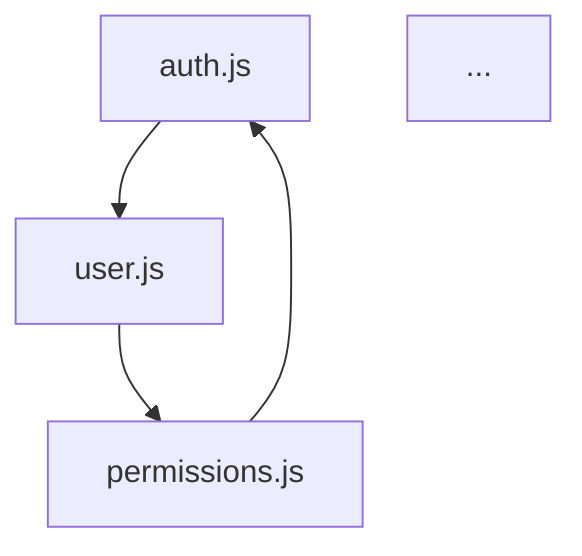

# MCP Agent Toolkit

<div align="center">

**Enterprise-grade AI development tools for Claude, Cursor, Windsurf, Qoder & all MCP-compatible editors**

🌍 **Multi-language Support**: Works in English and Spanish | Funciona en inglés y español

[](https://github.com/j0KZ/mcp-agents/actions/workflows/ci.yml)
[](https://www.npmjs.com/package/@j0kz/mcp-agents)
[](https://github.com/j0KZ/mcp-agents/releases)
[](LICENSE)
[](https://codecov.io/gh/j0KZ/mcp-agents)
[](https://modelcontextprotocol.io/)

[](https://github.com/j0KZ/mcp-agents/actions)
[](docs/PHASE3_SUMMARY.md)
[](https://github.com/j0KZ/mcp-agents/actions/workflows/codeql.yml)
[](https://github.com/j0KZ/mcp-agents/security)
[](CONTRIBUTING.md)
[](https://github.com/j0KZ/mcp-agents/wiki)

</div>

---

## 🚀 One-Line Installation

```bash
npx @j0kz/mcp-agents@latest
```

That's it! The installer automatically:
- ✅ Detects your editor (Claude, Cursor, Windsurf, Qoder, VS Code, Roo, etc.)
- ✅ Configures all 9 MCP tools with universal compatibility
- ✅ Adds proper `type: stdio` for maximum compatibility
- ✅ Clears npm cache to prevent issues
- ✅ Fixes malformed config files
- ✅ Works in English and Spanish

**Restart your editor and start using AI-powered development tools immediately!**

<details>
<summary>📱 Supported Editors</summary>

```bash
npx @j0kz/mcp-agents@latest           # Auto-detect
npx @j0kz/mcp-agents@latest claude    # Claude Code
npx @j0kz/mcp-agents@latest cursor    # Cursor
npx @j0kz/mcp-agents@latest windsurf  # Windsurf
npx @j0kz/mcp-agents@latest qoder     # Qoder
npx @j0kz/mcp-agents@latest vscode    # VS Code
npx @j0kz/mcp-agents@latest roo       # Roo Code
```

</details>

---

## 🎯 What You Get

<table>
<tr>
<td width="33%">

### 🔍 Code Quality
- **Smart Reviewer** - AI code review
- **Test Generator** - Comprehensive tests
- **Refactor Assistant** - Clean code

</td>
<td width="33%">

### 🏗️ Architecture
- **Architecture Analyzer** - Dependencies
- **API Designer** - REST/GraphQL
- **DB Schema** - Database design

</td>
<td width="33%">

### 🛡️ Security & Docs
- **Security Scanner** - Vulnerability scan
- **Doc Generator** - Auto documentation
- **Orchestrator** - Workflow automation

</td>
</tr>
</table>

---

## 💡 Real-World Usage

Just chat naturally with your AI assistant after installation:

<table>
<tr>
<td width="50%">

### Code Review (English / Español)
```
"Review my auth.js file"
"Revisar mi archivo auth.js"
"What code smells are in this?"
"Check for performance issues"
```

### Testing
```
"Generate tests for calculatePrice"
"Generar pruebas para calculatePrice"
"Add edge cases to my tests"
"Create integration tests"
```

### Security
```
"Scan for vulnerabilities"
"Escanear vulnerabilidades"
"Check for SQL injection"
"Find hardcoded secrets"
```

</td>
<td width="50%">

### Architecture
```
"Analyze project structure"
"Analizar estructura del proyecto"
"Find circular dependencies"
"Generate dependency graph"
```

### API Design
```
"Design REST API for users"
"Diseñar API REST para usuarios"
"Generate OpenAPI spec"
"Create GraphQL schema"
```

### Documentation
```
"Generate README"
"Generar README"
"Add JSDoc comments"
"Create API documentation"
```

</td>
</tr>
</table>

---

## 📊 Performance & Quality Metrics

<div align="center">

| Metric | Value | Status |
|--------|-------|--------|
| **Performance** | 2.18x faster | 🚀 Optimized |
| **Test Coverage** | 75% | ✅ Enforced |
| **Code Quality** | Score 88/100 | ⭐ Excellent |
| **Security** | 0 vulnerabilities | 🛡️ Hardened |
| **Tests** | 366 passing | ✅ Complete |
| **Complexity** | -36% reduction | 📈 Improved |

</div>

---

## 🔧 Detailed Usage Guide

Each tool below includes **clear examples in English and Spanish** with expected outputs.

<details>
<summary><b>🎯 Smart Reviewer</b> - AI-powered code review (Click to expand)</summary>

### How to Use

Just ask Claude naturally - the tool understands both languages:

#### English Examples
```
"Review my auth.js file"
"Check this file for code smells"
"What issues are in src/utils/validator.js?"
"Review this code and suggest improvements"
"Analyze code quality in my components"
```

#### Spanish Examples (Ejemplos en Español)
```
"Revisar mi archivo auth.js"
"Revisar este archivo"
"Qué problemas hay en src/utils/validator.js?"
"Analizar calidad del código en mis componentes"
"Chequear este código"
```

### What You Get

```javascript
✓ Code Quality Report:

📊 Metrics:
  - Complexity: 42 (moderate)
  - Maintainability: 72/100
  - Lines of Code: 234
  - Duplicate blocks: 2

⚠️ Issues Found (5):
  1. Unused variable 'temp' on line 42
  2. Missing error handling in async function (line 56)
  3. Potential memory leak in event listener (line 89)
  4. Magic number should be a constant (line 112)
  5. Function too complex (18 branches) - line 145

✅ Auto-fixes available for 3 issues
  - Run "Apply auto-fixes to auth.js" to fix automatically
```

### Features
- Quality metrics (complexity, maintainability, LOC)
- Auto-fix generation using Pareto principle (80/20 rule)
- Pattern detection and best practices
- Performance bottleneck identification
- Safe auto-apply mode

</details>

<details>
<summary><b>🧪 Test Generator</b> - Comprehensive test suites (Click to expand)</summary>

### How to Use

#### English Examples
```
"Generate tests for calculatePrice function"
"Create tests for UserService class"
"Add tests to src/utils/helpers.js"
"Generate integration tests for the API"
"Write tests with edge cases for validateEmail"
```

#### Spanish Examples (Ejemplos en Español)
```
"Generar pruebas para la función calculatePrice"
"Generar tests para calculatePrice"
"Crear pruebas para la clase UserService"
"Agregar tests a src/utils/helpers.js"
"Escribir pruebas con casos extremos para validateEmail"
```

### What You Get

```javascript
✓ Test Suite Generated for calculatePrice()

📝 24 tests created:

Happy Path (8 tests):
  ✓ should calculate price with valid inputs
  ✓ should apply discount correctly
  ✓ should handle zero quantity
  ...

Edge Cases (6 tests):
  ✓ should handle negative prices
  ✓ should handle very large quantities
  ✓ should handle decimal precision
  ...

Error Handling (5 tests):
  ✓ should throw on null input
  ✓ should handle missing parameters
  ✓ should validate price range
  ...

Boundary Conditions (5 tests):
  ✓ should handle min/max values
  ✓ should handle boundary prices
  ...

📊 Estimated Coverage: 94%
```

### Features
- Multiple framework support (Jest, Mocha, Vitest, AVA)
- Edge case detection
- Mock generation
- Coverage optimization
- Batch generation for multiple files

</details>

<details>
<summary><b>🏗️ Architecture Analyzer</b> - Dependency analysis (Click to expand)</summary>

### How to Use

#### English Examples
```
"Analyze project architecture"
"Find circular dependencies"
"Check for layer violations"
"Generate dependency graph"
"Show module info for src/services/auth.js"
```

#### Spanish Examples (Ejemplos en Español)
```
"Analizar arquitectura del proyecto"
"Analizar estructura del proyecto"
"Encontrar dependencias circulares"
"Buscar violaciones de capas"
"Generar gráfico de dependencias"
"Mostrar info del módulo src/services/auth.js"
```

### What You Get

```javascript
✓ Architecture Analysis Complete

🔍 Project Structure:
  - Total modules: 142
  - Max depth: 5 levels
  - Entry points: 3

⚠️ Issues Detected:

Circular Dependencies (2):
  1. auth.js → user.js → permissions.js → auth.js
  2. api.js → routes.js → api.js

Layer Violations (3):
  1. Presentation layer accessing Data layer directly
     src/components/UserList.jsx → src/db/queries.js

  2. Business layer bypassing abstraction
     src/services/order.js → src/db/connection.js

📊 Dependency Graph:


💡 Suggestions:
  - Break circular dependency in auth module
  - Add abstraction layer for data access
  - Consider splitting large modules
```

### Features
- Circular dependency detection
- Layer violation analysis
- Dependency graphs (Mermaid format)
- Module complexity metrics
- Configurable layer rules

</details>

<details>
<summary><b>🛡️ Security Scanner</b> - Vulnerability detection (Click to expand)</summary>

### How to Use

#### English Examples
```
"Scan for security vulnerabilities"
"Check for SQL injection"
"Find hardcoded secrets"
"Scan the entire project for security issues"
"Check auth.js for XSS vulnerabilities"
```

#### Spanish Examples (Ejemplos en Español)
```
"Escanear vulnerabilidades"
"Escanear seguridad"
"Buscar secretos hardcodeados"
"Revisar inyección SQL"
"Escanear todo el proyecto por problemas de seguridad"
"Revisar auth.js por vulnerabilidades XSS"
```

### What You Get

```javascript
✓ Security Scan Complete

🔒 Vulnerabilities Found: 6

CRITICAL (2):
  1. SQL Injection Risk
     File: src/db/query.js:45
     Code: `SELECT * FROM users WHERE id = ${userId}`
     Fix: Use parameterized queries

  2. Hardcoded API Key
     File: src/config.js:8
     Code: const API_KEY = "sk-1234567890abcdef"
     Fix: Move to environment variables

HIGH (3):
  3. XSS Vulnerability
     File: src/templates/user.html:12
     Code: <div>{{{ userInput }}}</div>
     Fix: Use HTML escaping

  4. Path Traversal Risk
     File: src/files/handler.js:23
     Code: fs.readFile(`uploads/${filename}`)
     Fix: Validate and sanitize file paths

  5. Weak Cryptography
     File: src/auth/crypto.js:15
     Code: crypto.createHash('md5')
     Fix: Use SHA-256 or bcrypt

MEDIUM (1):
  6. Outdated Dependency
     Package: express@4.16.0 (CVE-2022-24999)
     Fix: Update to express@^4.18.0

📊 Summary:
  - Critical: 2
  - High: 3
  - Medium: 1
  - Low: 0
```

### Features
- OWASP Top 10 detection
- Secret scanning (20+ patterns: API keys, passwords, tokens)
- SQL injection & XSS detection
- Dependency vulnerability checks (CVE scanning)
- Path traversal and command injection detection
- Customizable severity levels

</details>

<details>
<summary><b>🎨 API Designer</b> - REST/GraphQL design (Click to expand)</summary>

### How to Use

#### English Examples
```
"Design REST API for users and posts"
"Create GraphQL schema for a blog"
"Generate OpenAPI spec for my endpoints"
"Design API with OAuth2 authentication"
"Create REST endpoints for e-commerce"
```

#### Spanish Examples (Ejemplos en Español)
```
"Diseñar API REST para usuarios y posts"
"Diseñar API para usuarios"
"Crear esquema GraphQL para un blog"
"Generar especificación OpenAPI para mis endpoints"
"Diseñar API con autenticación OAuth2"
```

### What You Get

```yaml
✓ REST API Design Generated

📋 Endpoints Created (12):

Users Resource:
  GET    /api/v1/users          - List users (paginated)
  GET    /api/v1/users/:id      - Get user by ID
  POST   /api/v1/users          - Create user
  PUT    /api/v1/users/:id      - Update user
  DELETE /api/v1/users/:id      - Delete user

Posts Resource:
  GET    /api/v1/posts          - List posts
  GET    /api/v1/posts/:id      - Get post
  POST   /api/v1/posts          - Create post
  PUT    /api/v1/posts/:id      - Update post
  DELETE /api/v1/posts/:id      - Delete post

  GET    /api/v1/users/:id/posts - Get user's posts
  POST   /api/v1/users/:id/posts - Create post for user

🔒 Authentication: Bearer Token (JWT)
📄 Documentation: OpenAPI 3.0 spec generated
🧪 Mock Server: Ready to generate
```

### Features
- REST & GraphQL API design
- OpenAPI 3.0 specification generation
- Client SDK generation (TypeScript, Python, Java, etc.)
- Mock server creation
- Multiple auth types (API Key, OAuth2, JWT)
- Automatic validation rules

</details>

<details>
<summary><b>🗄️ DB Schema Designer</b> - Database design (Click to expand)</summary>

### How to Use

#### English Examples
```
"Design database schema for a blog"
"Create schema for users, posts, and comments"
"Design MongoDB schema for e-commerce"
"Generate migration for PostgreSQL"
"Create ER diagram for my schema"
```

#### Spanish Examples (Ejemplos en Español)
```
"Diseñar esquema de base de datos para un blog"
"Diseñar schema para blog"
"Crear esquema para usuarios, posts y comentarios"
"Diseñar esquema MongoDB para e-commerce"
"Generar migración para PostgreSQL"
```

### What You Get

```sql
✓ Database Schema Generated (PostgreSQL)

📊 Tables Created (3):

CREATE TABLE users (
  id UUID PRIMARY KEY DEFAULT gen_random_uuid(),
  email VARCHAR(255) UNIQUE NOT NULL,
  username VARCHAR(100) UNIQUE NOT NULL,
  password_hash VARCHAR(255) NOT NULL,
  created_at TIMESTAMP DEFAULT NOW(),
  updated_at TIMESTAMP DEFAULT NOW()
);

CREATE TABLE posts (
  id UUID PRIMARY KEY DEFAULT gen_random_uuid(),
  user_id UUID NOT NULL REFERENCES users(id) ON DELETE CASCADE,
  title VARCHAR(255) NOT NULL,
  content TEXT NOT NULL,
  published BOOLEAN DEFAULT FALSE,
  created_at TIMESTAMP DEFAULT NOW(),
  updated_at TIMESTAMP DEFAULT NOW()
);

CREATE TABLE comments (
  id UUID PRIMARY KEY DEFAULT gen_random_uuid(),
  post_id UUID NOT NULL REFERENCES posts(id) ON DELETE CASCADE,
  user_id UUID NOT NULL REFERENCES users(id) ON DELETE CASCADE,
  content TEXT NOT NULL,
  created_at TIMESTAMP DEFAULT NOW()
);

CREATE INDEX idx_posts_user_id ON posts(user_id);
CREATE INDEX idx_comments_post_id ON comments(post_id);
CREATE INDEX idx_posts_published ON posts(published);

✓ Normalized to 3NF
✓ 3 indexes created
✓ Migration files ready
✓ ER diagram generated
```

### Features
- SQL (PostgreSQL, MySQL) & NoSQL (MongoDB) support
- Automatic normalization (1NF, 2NF, 3NF, BCNF)
- Migration generation (up/down)
- ER diagram creation (Mermaid, PlantUML, DBML)
- Index optimization suggestions
- Seed data generation

</details>

<details>
<summary><b>📚 Doc Generator</b> - Documentation automation (Click to expand)</summary>

### How to Use

#### English Examples
```
"Generate README for this project"
"Add JSDoc comments to auth.js"
"Create API documentation"
"Generate changelog from git commits"
"Document all functions in utils/"
```

#### Spanish Examples (Ejemplos en Español)
```
"Generar README para este proyecto"
"Generar README"
"Agregar comentarios JSDoc a auth.js"
"Crear documentación de API"
"Generar changelog desde commits de git"
```

### What You Get

```markdown
✓ Documentation Generated

📄 README.md created with:
  - Project description
  - Installation instructions
  - Usage examples
  - API reference
  - Badges (build, coverage, version)
  - Table of contents
  - Contributing guidelines
  - License info

📝 JSDoc comments added (24 functions):
  /**
   * Authenticates a user with email and password
   * @param {string} email - User's email address
   * @param {string} password - User's password (plain text)
   * @returns {Promise<User>} Authenticated user object
   * @throws {AuthError} If credentials are invalid
   */
  async function authenticateUser(email, password) { ... }

📊 API Documentation generated:
  - All endpoints documented
  - Request/response examples
  - Authentication requirements
  - Error codes and messages

📜 CHANGELOG.md updated:
  ## [1.2.0] - 2025-01-15
  ### Added
  - User authentication system
  - Password reset functionality
  ### Fixed
  - Memory leak in event handlers
```

### Features
- README generation (with badges, TOC, examples)
- JSDoc/TSDoc comment generation
- API documentation (from code)
- Changelog generation (from git history)
- Multiple styles (Standard, Google, TypeScript)
- Batch documentation for entire projects

</details>

<details>
<summary><b>🔧 Refactor Assistant</b> - Code refactoring (Click to expand)</summary>

### How to Use

#### English Examples
```
"Extract this code block into a function"
"Convert callbacks to async/await in api.js"
"Simplify nested conditionals in validator.js"
"Remove dead code from utils/"
"Apply singleton pattern to DatabaseConnection"
```

#### Spanish Examples (Ejemplos en Español)
```
"Extraer este bloque de código en una función"
"Refactorizar este código"
"Convertir callbacks a async/await en api.js"
"Simplificar condicionales anidados en validator.js"
"Eliminar código muerto de utils/"
```

### What You Get

```javascript
✓ Refactoring Complete

Before (12 lines):
  function processUser(user, callback) {
    validateUser(user, function(err, valid) {
      if (err) return callback(err);
      if (!valid) return callback(new Error('Invalid'));
      saveUser(user, function(err, saved) {
        if (err) return callback(err);
        sendEmail(saved, function(err) {
          if (err) return callback(err);
          callback(null, saved);
        });
      });
    });
  }

After (7 lines, async/await):
  async function processUser(user) {
    const valid = await validateUser(user);
    if (!valid) throw new Error('Invalid user');
    const saved = await saveUser(user);
    await sendEmail(saved);
    return saved;
  }

✅ Improvements:
  - 42% fewer lines
  - Removed callback hell
  - Added proper error handling
  - More readable code
```

### Features
- Extract function/method/class
- Convert callbacks to async/await
- Simplify conditionals (guard clauses, ternary)
- Remove dead code (unused vars, unreachable code)
- Apply design patterns (Singleton, Factory, Observer, Strategy, etc.)
- Variable renaming (consistent across codebase)
- Code metrics calculation

</details>

<details>
<summary><b>🔗 Orchestrator</b> - Workflow automation (Click to expand)</summary>

### How to Use

#### English Examples
```
"Review, test, and document auth.js"
"Full security audit of the project"
"Complete code quality check"
"Review all files, find issues, generate tests, and fix"
"Design API, create schema, generate docs"
```

#### Spanish Examples (Ejemplos en Español)
```
"Revisar, probar y documentar auth.js"
"Auditoría de seguridad completa del proyecto"
"Revisión completa de calidad de código"
"Revisar archivos, encontrar problemas, generar tests"
"Diseñar API, crear schema, generar docs"
```

### What You Get

```javascript
✓ Workflow Pipeline Executed

🔄 Step 1/4: Code Review
  ✓ Reviewed auth.js
  ⚠️ Found 5 issues

🔄 Step 2/4: Security Scan
  ✓ Scanned for vulnerabilities
  🔴 Found 2 critical issues

🔄 Step 3/4: Test Generation
  ✓ Generated 18 tests
  📊 Coverage: 92%

🔄 Step 4/4: Documentation
  ✓ Added JSDoc comments
  ✓ Updated README

✅ Pipeline Complete (4/4 steps)

📊 Summary:
  - Issues found: 5
  - Critical vulnerabilities: 2
  - Tests generated: 18
  - Documentation: Updated

💡 Next Steps:
  1. Fix critical security issues
  2. Run tests: npm test
  3. Review auto-generated docs
```

### Features
- Chain multiple MCP tools
- Pre-built workflows (quality check, security audit, full docs)
- Conditional execution (skip steps on errors)
- CI/CD integration templates
- Batch operations (multiple files/projects)
- Custom pipeline creation

</details>

---

## 🚀 CI/CD Integration

Add automated quality checks to your pipeline:

### GitHub Actions
```bash
# Quick setup
curl -o .github/workflows/mcp-quality.yml \
  https://raw.githubusercontent.com/j0KZ/mcp-agents/main/templates/github-actions/mcp-basic.yml
```

### Pre-commit Hooks
```bash
npx @j0kz/mcp-hooks-generator basic
```

### GitLab CI
```yaml
include:
  - remote: 'https://raw.githubusercontent.com/j0KZ/mcp-agents/main/templates/gitlab-ci/mcp-quality-gate.gitlab-ci.yml'
```

[📚 Full CI/CD Guide](docs/development/CI_CD_TEMPLATES.md)

---

## 📦 Features Comparison

<table>
<thead>
<tr>
<th>Feature</th>
<th>MCP Agent Toolkit</th>
<th>Traditional Tools</th>
</tr>
</thead>
<tbody>
<tr>
<td><b>Installation</b></td>
<td>✅ One command</td>
<td>❌ Multiple tools & configs</td>
</tr>
<tr>
<td><b>AI Integration</b></td>
<td>✅ Native MCP support</td>
<td>❌ Manual integration</td>
</tr>
<tr>
<td><b>Performance</b></td>
<td>✅ 2.18x faster with caching</td>
<td>❌ No intelligent caching</td>
</tr>
<tr>
<td><b>Coverage</b></td>
<td>✅ 9 tools in one package</td>
<td>❌ Separate installations</td>
</tr>
<tr>
<td><b>Updates</b></td>
<td>✅ Synchronized versions</td>
<td>❌ Version conflicts</td>
</tr>
<tr>
<td><b>Editor Support</b></td>
<td>✅ All MCP editors</td>
<td>❌ Limited support</td>
</tr>
</tbody>
</table>

---

## 🎯 Quick Start Examples

### 1. Code Quality Check
```bash
"Review all files in src/ and generate tests for uncovered functions"
```

### 2. Security Audit
```bash
"Scan the entire project for security vulnerabilities and generate a report"
```

### 3. API Documentation
```bash
"Generate OpenAPI documentation for all endpoints in server.js"
```

### 4. Architecture Review
```bash
"Analyze dependencies and find circular references"
```

### 5. Database Design
```bash
"Design a schema for a blog with users, posts, and comments"
```

---

## 📚 Documentation

<div align="center">

| Resource | Description |
|----------|-------------|
| [**📖 Wiki**](https://github.com/j0KZ/mcp-agents/wiki) | Complete documentation |
| [**🚀 Quick Start**](https://github.com/j0KZ/mcp-agents/wiki/Quick-Start) | Get started in 5 minutes |
| [**🔧 Configuration**](https://github.com/j0KZ/mcp-agents/wiki/Configuration) | Editor setup guides |
| [**💡 Examples**](examples/) | Real-world usage patterns |
| [**🐛 Troubleshooting**](https://github.com/j0KZ/mcp-agents/wiki/Troubleshooting) | Common issues & solutions |

</div>

---

## 🤝 Contributing

We welcome contributions! See our [Contributing Guide](CONTRIBUTING.md) for details.

```bash
# Clone the repo
git clone https://github.com/j0KZ/mcp-agents.git

# Install dependencies
npm install

# Run tests
npm test

# Build all packages
npm run build
```

---

## 📈 Project Stats

<div align="center">

[](https://github.com/j0KZ/mcp-agents)
[](https://github.com/j0KZ/mcp-agents/fork)
[](https://github.com/j0KZ/mcp-agents/issues)
[](https://github.com/j0KZ/mcp-agents/pulls)

</div>

---

## 📄 License

MIT © [j0KZ](https://github.com/j0KZ)

Each package is independently licensed under MIT.

---

<div align="center">

**Made with ❤️ for the AI developer community**

[Report Bug](https://github.com/j0KZ/mcp-agents/issues) · [Request Feature](https://github.com/j0KZ/mcp-agents/issues) · [Join Discussion](https://github.com/j0KZ/mcp-agents/discussions)

</div>