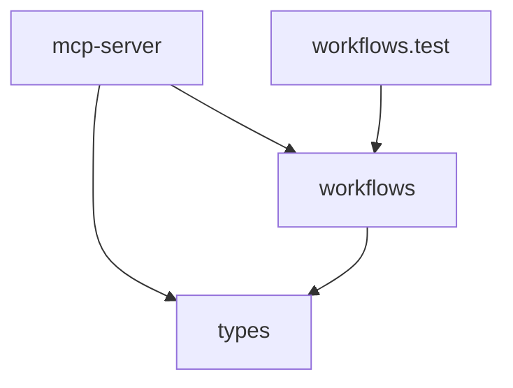
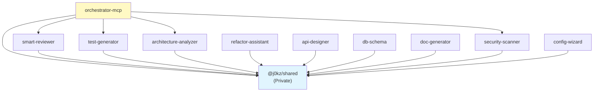

# Package Architecture

This document provides architectural diagrams for the MCP Agents monorepo packages.

## Orchestrator MCP Package Structure

The orchestrator-mcp package coordinates workflows between multiple MCP tools.

### Dependency Graph



### Module Summary

**Total Modules:** 10 (excluding coverage artifacts: 6 source modules)

| Module            | LOC | Dependencies           | Exports                                                                                                |
| ----------------- | --- | ---------------------- | ------------------------------------------------------------------------------------------------------ |
| mcp-server.ts     | 255 | workflows.js, types.js | -                                                                                                      |
| workflows.ts      | 214 | types.js               | WORKFLOWS, createPreCommitWorkflow, createPreMergeWorkflow, createQualityAuditWorkflow, createWorkflow |
| workflows.test.ts | 95  | workflows.js           | -                                                                                                      |
| types.ts          | 45  | -                      | WorkflowDefinition, WorkflowStep, WorkflowContext, etc.                                                |

### Architecture Metrics

- **Total Dependencies:** 0 external (all internal)
- **Circular Dependencies:** 0 ✅
- **Layer Violations:** 0 ✅
- **Cohesion:** Low (needs improvement)
- **Coupling:** 0% (excellent isolation)

### Key Design Patterns

1. **Workflow Factory Pattern** - `createPreCommitWorkflow()`, `createPreMergeWorkflow()`, `createQualityAuditWorkflow()`
2. **Pipeline Pattern** - MCPPipeline from @j0kz/shared for step execution
3. **MCP Server Pattern** - Standard MCP protocol implementation

## Monorepo Overview

### Package Dependency Structure



### Package Categories

**Core MCP Tools (9):**

- smart-reviewer - Code review and quality analysis
- test-generator - Test suite generation
- architecture-analyzer - Dependency analysis
- refactor-assistant - Code refactoring tools
- api-designer - REST/GraphQL API design
- db-schema - Database schema design
- doc-generator - Documentation generation
- security-scanner - Security vulnerability scanning
- orchestrator-mcp - MCP workflow orchestration

**Supporting Packages (2):**

- @j0kz/shared (private) - Common utilities, caching, performance monitoring
- config-wizard - Installation and configuration wizard

## Architecture Principles

### 1. Shared Utilities Pattern

All tools import common functionality from `@j0kz/shared`:

- **FileSystemManager** - File operations with caching
- **AnalysisCache** - LRU cache for analysis results (30min TTL)
- **PerformanceMonitor** - Performance tracking and metrics
- **MCPPipeline/MCPIntegration** - Inter-MCP communication
- **Path validation** - Security utilities

### 2. MCP Server Pattern

Every tool follows the same structure:

- `src/mcp-server.ts` - MCP protocol entrypoint
- Main logic in separate files (e.g., `analyzer.ts`, `generator.ts`)
- Uses `@modelcontextprotocol/sdk` version ^1.19.1

### 3. Zero Circular Dependencies

The architecture maintains strict acyclic dependency graph:

- ✅ No circular dependencies detected
- ✅ Clean separation of concerns
- ✅ Proper workspace isolation

### 4. Workflow Orchestration

The orchestrator-mcp enables complex workflows:

```
Pre-Commit: Review → Security Scan
Pre-Merge: Review → Architecture → Security → Tests
Quality Audit: Review → Architecture → Security
```

## Metrics Summary

| Package            | Complexity | Maintainability | LOC | Test Coverage |
| ------------------ | ---------- | --------------- | --- | ------------- |
| smart-reviewer     | 24         | 46              | 167 | 65%           |
| security-scanner   | 36         | 34              | 246 | 74%           |
| api-designer       | 38         | 34              | 239 | 56%           |
| test-generator     | 56         | 29              | 249 | 59%           |
| refactor-assistant | 69         | 20              | 326 | 68%           |
| orchestrator-mcp   | -          | -               | 255 | 85%           |

## Recent Improvements (v1.0.31)

**Refactoring Achievements:**

- Security Scanner: 57/100 → 100/100 (+75%)
- DB Schema: 75/100 → 97/100 (+29%)
- Refactor Assistant: 77/100 → 78/100 (complexity reduced)

**Coverage Achievements:**

- Overall: 61.69% → 66.14% (+4.45%)
- All thresholds exceeded ✅

---

**Last Updated:** 2025-10-06
**Architecture Analyzer Version:** 1.0.31
