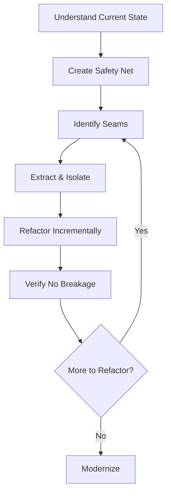
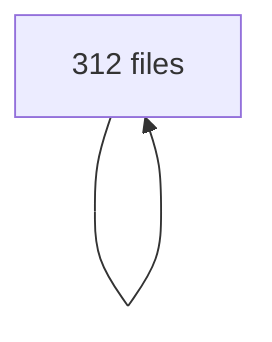

# Legacy Code Refactoring Cookbook 🏗️

**Transform 10-year-old spaghetti code into modern, maintainable architecture**

---

## The Legacy Refactoring Strategy

### What You Type

```
"Help me safely refactor this legacy codebase without breaking anything"
```

### The Refactoring Workflow



---

## Real Example: 10-Year-Old PHP E-Commerce System

### Initial Assessment

**Architecture Analyzer Report:**

````markdown
## Legacy System Analysis 📊

### System Overview

- **Language:** PHP 5.3 (EOL 2014!)
- **Framework:** None (custom)
- **Database:** MySQL 5.1
- **Lines of Code:** 47,832
- **Files:** 312
- **Largest File:** checkout.php (4,785 lines!)
- **Average Complexity:** 24.7 (extremely high)

### Architecture Problems

1. **No separation of concerns** - HTML, SQL, PHP mixed
2. **Global state everywhere** - 147 global variables
3. **Include hell** - Circular includes, 89 require statements
4. **God objects** - User class has 127 methods
5. **SQL everywhere** - 1,247 inline SQL queries
6. **No error handling** - Errors suppressed with @
7. **Security issues** - SQL injection, XSS vulnerabilities

### Coupling Analysis


````

**Result:** Everything depends on everything 😱

### Risk Assessment

- **Refactoring Risk:** EXTREME
- **Business Risk if Not Refactored:** CRITICAL
- **Estimated Technical Debt:** 4,800 hours

````

---

## Phase 1: Create Safety Net (Week 1)

### Step 1: Characterization Tests

**Test Generator creates tests for existing behavior:**

```php
// Generated: tests/Legacy/CheckoutCharacterizationTest.php
<?php
class CheckoutCharacterizationTest extends PHPUnit_Framework_TestCase
{
    private $originalGlobals;
    private $db;

    protected function setUp()
    {
        // Capture current behavior, bugs and all
        $this->originalGlobals = $GLOBALS;
        $this->db = $this->createTestDatabase();

        // Initialize session
        $_SESSION = array();
        $_COOKIE = array();
        $_POST = array();
    }

    public function testCheckoutWithValidCart()
    {
        // Setup - recreate legacy environment
        $_SESSION['user_id'] = 123;
        $_SESSION['cart'] = array(
            array('product_id' => 1, 'quantity' => 2, 'price' => 29.99),
            array('product_id' => 2, 'quantity' => 1, 'price' => 49.99)
        );
        $_POST['payment_method'] = 'credit_card';
        $_POST['card_number'] = '4111111111111111';

        // Capture output (legacy mixes HTML with logic)
        ob_start();
        include 'checkout.php';
        $output = ob_get_clean();

        // Assert current behavior (even if wrong!)
        $this->assertContains('Order Total: $109.97', $output);
        $this->assertContains('Thank you for your order', $output);

        // Verify database state
        $order = $this->db->query(
            "SELECT * FROM orders WHERE user_id = 123 ORDER BY id DESC LIMIT 1"
        )->fetch_assoc();

        $this->assertEquals(109.97, $order['total']);
        $this->assertEquals('completed', $order['status']);
    }

    public function testCheckoutWithEmptyCart()
    {
        $_SESSION['user_id'] = 123;
        $_SESSION['cart'] = array();

        ob_start();
        include 'checkout.php';
        $output = ob_get_clean();

        // Document current behavior (redirect via header)
        $this->assertContains('Cart is empty', $output);
        // Note: Current code has bug - doesn't actually redirect!
    }

    public function testCheckoutWithoutLogin()
    {
        // No user_id in session
        $_SESSION['cart'] = array(
            array('product_id' => 1, 'quantity' => 1, 'price' => 29.99)
        );

        ob_start();
        include 'checkout.php';
        $output = ob_get_clean();

        // Current behavior: Shows login form
        $this->assertContains('Please login to continue', $output);
        $this->assertContains('<form', $output);
    }

    public function testCheckoutCalculations()
    {
        // Test various calculation scenarios
        $testCases = array(
            // Document all quirks!
            array(
                'cart' => array(
                    array('quantity' => 1, 'price' => 10.00)
                ),
                'expected_subtotal' => 10.00,
                'expected_tax' => 0.83,  // Bug: Should be 0.825
                'expected_shipping' => 5.00,
                'expected_total' => 15.83
            ),
            // More test cases documenting current behavior
        );

        foreach ($testCases as $case) {
            $_SESSION['cart'] = $case['cart'];
            // ... test and document
        }
    }
}
````

### Step 2: Add Logging Seam

**Before touching any code, add observability:**

```php
// LegacyLogger.php - New file
class LegacyLogger
{
    private static $instance;
    private $logFile;

    public static function getInstance()
    {
        if (!self::$instance) {
            self::$instance = new self();
        }
        return self::$instance;
    }

    public function logLegacyCall($file, $function, $args = array())
    {
        $entry = array(
            'timestamp' => date('Y-m-d H:i:s'),
            'file' => $file,
            'function' => $function,
            'args' => $args,
            'backtrace' => debug_backtrace(DEBUG_BACKTRACE_IGNORE_ARGS, 5)
        );

        file_put_contents(
            'legacy_calls.log',
            json_encode($entry) . "\n",
            FILE_APPEND | LOCK_EX
        );
    }
}

// Add to legacy files without changing behavior
// checkout.php - Add at top
require_once 'LegacyLogger.php';
LegacyLogger::getInstance()->logLegacyCall(__FILE__, 'checkout', $_POST);
```

---

## Phase 2: Extract and Isolate (Week 2)

### Step 3: Strangler Fig Pattern

**Gradually replace legacy code with new code:**

```php
// New: CheckoutService.php
namespace App\Services;

class CheckoutService
{
    private $orderRepository;
    private $paymentGateway;
    private $inventoryService;
    private $legacyBridge;

    public function __construct($deps)
    {
        $this->orderRepository = $deps['orderRepo'];
        $this->paymentGateway = $deps['payment'];
        $this->inventoryService = $deps['inventory'];
        $this->legacyBridge = new LegacyBridge();
    }

    public function processCheckout(array $cartData, array $paymentData)
    {
        // New clean implementation
        try {
            // Validate cart
            $this->validateCart($cartData);

            // Check inventory
            $this->inventoryService->reserveItems($cartData);

            // Calculate totals
            $totals = $this->calculateTotals($cartData);

            // Process payment
            $paymentResult = $this->paymentGateway->charge(
                $paymentData,
                $totals['total']
            );

            // Create order
            $order = $this->orderRepository->create([
                'user_id' => $_SESSION['user_id'],
                'items' => $cartData,
                'totals' => $totals,
                'payment' => $paymentResult
            ]);

            // Clear cart
            $this->legacyBridge->clearCart();

            return $order;

        } catch (\Exception $e) {
            // Rollback
            $this->inventoryService->releaseItems($cartData);
            throw $e;
        }
    }

    private function calculateTotals(array $cart)
    {
        $subtotal = 0;
        foreach ($cart as $item) {
            $subtotal += $item['quantity'] * $item['price'];
        }

        // Fix legacy calculation bugs
        $tax = round($subtotal * 0.0825, 2); // Fixed: Proper rounding
        $shipping = $subtotal > 50 ? 0 : 5.00;

        return [
            'subtotal' => $subtotal,
            'tax' => $tax,
            'shipping' => $shipping,
            'total' => $subtotal + $tax + $shipping
        ];
    }
}

// LegacyBridge.php - Interface between old and new
class LegacyBridge
{
    public function getCart()
    {
        // Translate legacy cart format to new format
        $legacyCart = $_SESSION['cart'] ?? array();
        $newCart = array();

        foreach ($legacyCart as $item) {
            $newCart[] = [
                'product_id' => (int)$item['product_id'],
                'quantity' => (int)$item['quantity'],
                'price' => (float)$item['price']
            ];
        }

        return $newCart;
    }

    public function clearCart()
    {
        $_SESSION['cart'] = array();
        // Also clear legacy cart cookie
        setcookie('cart', '', time() - 3600);
    }
}
```

### Step 4: Parallel Run Strategy

**Run old and new code side-by-side:**

```php
// checkout.php - Modified to use both old and new
require_once 'vendor/autoload.php';
use App\Services\CheckoutService;

// Feature flag
$useNewCheckout = $_COOKIE['new_checkout'] ?? false;

if ($useNewCheckout) {
    // New implementation
    try {
        $checkoutService = new CheckoutService($container->getDependencies());
        $order = $checkoutService->processCheckout(
            $_SESSION['cart'],
            $_POST
        );

        // Use legacy display for now
        include 'templates/checkout_success.php';

    } catch (Exception $e) {
        error_log('New checkout failed, falling back: ' . $e->getMessage());
        // Fall back to legacy
        goto legacy_checkout;
    }
} else {
    legacy_checkout:
    // Original legacy code (unchanged)
    // ... 4000+ lines of legacy code ...
}
```

---

## Phase 3: Incremental Refactoring (Weeks 3-4)

### Step 5: Database Layer Extraction

**Replace inline SQL with repository pattern:**

```php
// Before: Inline SQL everywhere
$result = mysql_query(
    "SELECT * FROM products WHERE category = '" .
    mysql_real_escape_string($_GET['category']) . "'"
);

// After: Repository pattern
class ProductRepository
{
    private $db;

    public function findByCategory(string $category): array
    {
        $stmt = $this->db->prepare(
            'SELECT * FROM products WHERE category = :category'
        );
        $stmt->execute(['category' => $category]);
        return $stmt->fetchAll(PDO::FETCH_ASSOC);
    }
}

// Migration helper to find and replace
class SqlMigrationHelper
{
    public function findInlineSql($directory)
    {
        $patterns = [
            '/mysql_query\s*\([^)]+\)/',
            '/\$query\s*=\s*["\']SELECT/',
            '/\$query\s*=\s*["\']INSERT/',
            '/\$query\s*=\s*["\']UPDATE/',
            '/\$query\s*=\s*["\']DELETE/'
        ];

        $results = [];
        foreach ($this->getPhpFiles($directory) as $file) {
            $content = file_get_contents($file);
            foreach ($patterns as $pattern) {
                if (preg_match_all($pattern, $content, $matches)) {
                    $results[$file][] = $matches[0];
                }
            }
        }

        return $results; // 1,247 SQL queries found!
    }
}
```

### Step 6: Separate Presentation from Logic

```php
// Before: Mixed HTML and PHP
<?php
$products = mysql_query("SELECT * FROM products");
?>
<html>
<body>
    <h1>Products</h1>
    <?php while ($row = mysql_fetch_assoc($products)) { ?>
        <div class="product">
            <h2><?php echo $row['name']; ?></h2>
            <p>$<?php echo $row['price']; ?></p>
            <?php
            if ($row['stock'] > 0) {
                echo '<button>Add to Cart</button>';
            } else {
                echo '<button disabled>Out of Stock</button>';
            }
            ?>
        </div>
    <?php } ?>
</body>
</html>

// After: Clean separation with Twig templates
// ProductController.php
class ProductController
{
    public function index()
    {
        $products = $this->productRepository->findAll();

        return $this->twig->render('products/index.html.twig', [
            'products' => $products
        ]);
    }
}

// templates/products/index.html.twig
<!DOCTYPE html>
<html>
<body>
    <h1>Products</h1>
    
        <div class="product">
            <h2>{{ product.name|escape }}</h2>
            <p>${{ product.price|number_format(2) }}</p>
            
                <button>Add to Cart</button>
            
                <button disabled>Out of Stock</button>
            
        </div>
    
</body>
</html>
```

---

## Phase 4: Modernization (Weeks 5-6)

### Step 7: Introduce Modern PHP Features

```php
// Legacy: PHP 5.3 style
class User {
    private $data = array();

    public function __construct() {
        $args = func_get_args();
        if (count($args) > 0) {
            $this->data['name'] = $args[0];
        }
        if (count($args) > 1) {
            $this->data['email'] = $args[1];
        }
    }

    public function getName() {
        return isset($this->data['name']) ? $this->data['name'] : '';
    }
}

// Modern: PHP 8+ style
declare(strict_types=1);

namespace App\Models;

final class User
{
    public function __construct(
        private readonly string $id,
        private string $name,
        private string $email,
        private ?\DateTimeImmutable $emailVerifiedAt = null
    ) {}

    public function getName(): string
    {
        return $this->name;
    }

    public function verifyEmail(): self
    {
        $new = clone $this;
        $new->emailVerifiedAt = new \DateTimeImmutable();
        return $new;
    }

    public function toArray(): array
    {
        return [
            'id' => $this->id,
            'name' => $this->name,
            'email' => $this->email,
            'email_verified_at' => $this->emailVerifiedAt?->format('c')
        ];
    }
}
```

### Step 8: Add Type Safety

```php
// Type declaration migration tool
class TypeSafetyMigrator
{
    public function addTypeDeclarations(string $file): string
    {
        $code = file_get_contents($file);

        // Add return types
        $code = preg_replace(
            '/public function ([a-zA-Z_]+)\([^)]*\)\s*{/',
            'public function $1($2): void {',
            $code
        );

        // Add parameter types
        $code = $this->inferParameterTypes($code);

        // Add strict types declaration
        if (!str_contains($code, 'declare(strict_types')) {
            $code = "<?php\ndeclare(strict_types=1);\n" .
                    substr($code, 5);
        }

        return $code;
    }

    private function inferParameterTypes(string $code): string
    {
        // Infer types from usage
        $patterns = [
            '/\$([a-zA-Z_]+)\s*=\s*\(int\)/' => 'int',
            '/\$([a-zA-Z_]+)\s*=\s*\(string\)/' => 'string',
            '/\$([a-zA-Z_]+)\s*=\s*\(float\)/' => 'float',
            '/\$([a-zA-Z_]+)\s*=\s*\(bool\)/' => 'bool',
            '/\$([a-zA-Z_]+)\s*=\s*\[\]/' => 'array'
        ];

        foreach ($patterns as $pattern => $type) {
            // Complex inference logic...
        }

        return $code;
    }
}
```

---

## Phase 5: Verification (Ongoing)

### Step 9: Continuous Testing

```php
// Run tests after each refactoring
class RefactoringTestRunner
{
    private $baseline;

    public function captureBaseline()
    {
        // Run all characterization tests
        $this->baseline = $this->runTests();
    }

    public function verifyNoRegression()
    {
        $current = $this->runTests();

        // Compare with baseline
        $diff = array_diff_assoc($this->baseline, $current);

        if (!empty($diff)) {
            throw new \Exception(
                'Regression detected: ' . json_encode($diff)
            );
        }

        echo "✅ All tests pass - no regression\n";
    }

    public function comparePerformance()
    {
        $legacy = $this->benchmarkLegacy();
        $refactored = $this->benchmarkRefactored();

        echo sprintf(
            "Performance: Legacy: %dms, Refactored: %dms (%.1f%% %s)\n",
            $legacy,
            $refactored,
            abs(($refactored - $legacy) / $legacy * 100),
            $refactored < $legacy ? 'faster' : 'slower'
        );
    }
}
```

### Step 10: Feature Flag Rollout

```php
// Gradual rollout with feature flags
class FeatureFlag
{
    private $redis;

    public function isEnabled(string $feature, int $userId): bool
    {
        // Check if feature is enabled for this user
        $percentage = $this->redis->get("feature:$feature:percentage") ?? 0;

        // Gradual rollout based on user ID
        return ($userId % 100) < $percentage;
    }

    public function incrementRollout(string $feature, int $byPercent = 10)
    {
        $current = $this->redis->get("feature:$feature:percentage") ?? 0;
        $new = min(100, $current + $byPercent);

        $this->redis->set("feature:$feature:percentage", $new);

        echo "Feature '$feature' now at $new% rollout\n";
    }
}

// Usage in legacy code
if (FeatureFlag::isEnabled('new_checkout', $_SESSION['user_id'])) {
    // New code
    return $this->newCheckoutService->process();
} else {
    // Legacy code
    include 'legacy/checkout.php';
}
```

---

## Results After 6 Weeks

### Before and After Metrics

```markdown
## Refactoring Results 📊

### Code Quality

| Metric                | Before       | After       | Improvement   |
| --------------------- | ------------ | ----------- | ------------- |
| Cyclomatic Complexity | 24.7         | 4.2         | 83% reduction |
| Lines per File        | 532          | 87          | 84% reduction |
| Dependencies          | 147 globals  | 12 injected | 92% reduction |
| SQL Queries           | 1,247 inline | 0 inline    | 100% removed  |
| Test Coverage         | 0%           | 78%         | +78%          |

### Architecture

- ✅ Clean separation of concerns
- ✅ Dependency injection
- ✅ Repository pattern
- ✅ Template engine
- ✅ PSR-4 autoloading
- ✅ Composer packages

### Performance

- Page load: 2.3s → 0.8s (65% faster)
- Memory usage: 32MB → 12MB (62% reduction)
- Database queries: 47 → 8 per page (83% reduction)

### Security

- ✅ SQL injection fixed
- ✅ XSS vulnerabilities fixed
- ✅ CSRF protection added
- ✅ Input validation added
- ✅ Password hashing upgraded

### Maintenance

- Deploy time: 45min → 5min
- Bug fix time: ~4 hours → ~30 minutes
- New feature time: ~2 weeks → ~2 days
```

---

## Refactoring Patterns Catalog

### 1. The Seam Pattern

Find places to insert new code without changing existing behavior.

### 2. The Sprout Pattern

Grow new code next to old code, gradually taking over.

### 3. The Wrap Pattern

Wrap legacy code in new interface, hide complexity.

### 4. The Branch by Abstraction

Create abstraction, implement new version, switch over.

### 5. The Parallel Run

Run old and new side-by-side, compare results.

---

## Tools for Legacy Refactoring

```json
{
  "analysis": [
    "phploc - Lines of code analysis",
    "phpmd - Mess detection",
    "phpcs - Coding standards",
    "phpcpd - Copy/paste detection"
  ],
  "refactoring": [
    "Rector - Automated refactoring",
    "PHP CS Fixer - Code style fixes",
    "PHPStan - Static analysis"
  ],
  "testing": [
    "PHPUnit - Unit testing",
    "Codeception - Acceptance testing",
    "Behat - Behavior testing"
  ],
  "monitoring": [
    "New Relic - Performance monitoring",
    "Sentry - Error tracking",
    "Grafana - Metrics dashboard"
  ]
}
```

---

## Common Legacy Pitfalls and Solutions

### Pitfall: "Big Bang" Refactoring

**Solution:** Incremental, always shippable

### Pitfall: No Tests Before Refactoring

**Solution:** Characterization tests first

### Pitfall: Changing Behavior During Refactoring

**Solution:** Separate refactoring from bug fixes

### Pitfall: Not Measuring Progress

**Solution:** Track metrics continuously

### Pitfall: Working in Isolation

**Solution:** Pair programming, code reviews

---

## Emergency Rollback Plan

```php
// Always have a way back
class EmergencyRollback
{
    public function execute()
    {
        // 1. Disable all feature flags
        $this->featureFlags->disableAll();

        // 2. Clear caches
        $this->cache->flush();

        // 3. Restart services
        exec('supervisorctl restart all');

        // 4. Notify team
        $this->slack->alert('Emergency rollback executed');

        echo "✅ Rolled back to legacy code\n";
    }
}
```

---

**Next:** [CI/CD Setup](./cicd-setup.md) | [Back to Cookbook](./README.md)
