# Pre-PR Review Cookbook 🚀

**Never push bad code again - Complete quality check before creating pull requests**

---

## The Complete Pre-PR Workflow

### What You Type in Claude/Cursor

```
"I'm about to create a PR. Run a complete quality check on my changes"
```

### What Happens (Orchestrated Workflow)

```mermaid
graph TD
    A[Start Pre-PR Check] --> B[Smart Reviewer]
    B --> C{Issues Found?}
    C -->|Yes| D[Auto-Fix Safe Issues]
    C -->|No| E[Security Scanner]
    D --> E
    E --> F{Vulnerabilities?}
    F -->|Critical| G[Block PR]
    F -->|None/Low| H[Test Generator]
    H --> I{Coverage < 80%?}
    I -->|Yes| J[Generate Missing Tests]
    I -->|No| K[Architecture Analyzer]
    J --> K
    K --> L[Doc Generator]
    L --> M[Final Report]
    M --> N{All Checks Pass?}
    N -->|Yes| O[Ready for PR ✅]
    N -->|No| P[Fix Required Issues]
```



---

## Real-World Example

### Initial State

You've been working on a new feature - a user authentication module. Your changes include:

- `src/auth/authService.js` - Main authentication logic
- `src/auth/tokenManager.js` - JWT token handling
- `src/controllers/userController.js` - Updated endpoints
- `src/utils/validators.js` - Input validation helpers

### Step 1: Smart Reviewer Analysis

**Tool Output:**

```markdown
## Smart Review Report

### Code Quality Issues (15 found, 12 auto-fixed)

✅ **Auto-Fixed:**

- Removed 3 unused variables
- Fixed 5 inconsistent indentations
- Added 4 missing semicolons

⚠️ **Manual Review Required:**

1. **High Complexity** in authService.authenticate()
   - Cyclomatic complexity: 12 (threshold: 10)
   - Suggestion: Extract validation logic

2. **Code Duplication** between authService.js:45-67 and userController.js:123-145
   - Suggestion: Extract to shared utility

3. **Missing Error Handling** in tokenManager.refreshToken()
   - No catch block for JWT verification
```

### Step 2: Security Scanner

**Tool Output:**

````markdown
## Security Scan Report

### 🔴 Critical Issues (1)

1. **SQL Injection Risk** at userController.js:78

```javascript
// BEFORE (Your Code):
const user = await db.query(`SELECT * FROM users WHERE email = '${email}'`);

// REQUIRED FIX:
const user = await db.query('SELECT * FROM users WHERE email = ?', [email]);
```
````

### 🟡 Medium Issues (2)

1. **Weak JWT Secret** in tokenManager.js
   - Using hardcoded secret
   - Fix: Use environment variable

2. **Missing Rate Limiting** on /login endpoint
   - Vulnerable to brute force
   - Fix: Add express-rate-limit

### 🟢 Passed Checks ✅

- No hardcoded credentials
- No exposed sensitive data
- Input validation present

````

### Step 3: Test Coverage Check

**Current Coverage:** 45% 😱

**Test Generator Output:**
```javascript
// Generated: authService.test.js
describe('AuthService', () => {
    describe('authenticate', () => {
        it('should authenticate valid credentials', async () => {
            const result = await authService.authenticate('user@test.com', 'password123');
            expect(result.success).toBe(true);
            expect(result.token).toBeDefined();
        });

        it('should reject invalid credentials', async () => {
            const result = await authService.authenticate('user@test.com', 'wrong');
            expect(result.success).toBe(false);
        });

        it('should handle SQL injection attempts', async () => {
            const result = await authService.authenticate("admin' OR '1'='1", 'password');
            expect(result.success).toBe(false);
        });

        // ... 15 more test cases
    });
});

// Generated: tokenManager.test.js
// ... 20 test cases

// Generated: validators.test.js
// ... 12 test cases
````

**New Coverage:** 87% 🎉

### Step 4: Architecture Check

**Architecture Analyzer Output:**

````markdown
## Architecture Analysis

### ✅ Clean Architecture Maintained

- Proper layer separation (controllers → services → data)
- No circular dependencies detected

### ⚠️ Suggestions

1. **High Coupling** between authService and tokenManager
   - Coupling score: 0.8 (threshold: 0.5)
   - Consider dependency injection

2. **Missing Interface** for auth provider
   - Current implementation tightly coupled to JWT
   - Add AuthProvider interface for flexibility

### Dependency Graph


````

````

### Step 5: Documentation Update

**Doc Generator Output:**
```markdown
## Updated Documentation

### API Changes
✅ Added to API.md:
- POST /api/auth/login
- POST /api/auth/refresh
- POST /api/auth/logout

### Code Documentation
✅ Generated JSDoc for 12 functions
✅ Updated README with authentication flow
✅ Created CHANGELOG entry

### Suggested Commit Message
````

feat(auth): implement JWT-based authentication system

- Add authService with login/logout/refresh capabilities
- Implement secure token management with refresh tokens
- Add input validation for auth endpoints
- Include comprehensive test suite (87% coverage)

Security: Fixed SQL injection vulnerability
Tests: Added 47 new test cases
Docs: Updated API documentation

Closes #123

```

```

---

## Final Checklist Output

````markdown
# Pre-PR Checklist ✅

## Quality Metrics

- ✅ Code Quality Score: 8.5/10
- ✅ Test Coverage: 87%
- ✅ Security Score: 9/10
- ✅ No breaking changes detected

## Required Actions Before PR

### 🔴 Must Fix (Blocking)

1. [ ] Fix SQL injection in userController.js:78
2. [ ] Move JWT secret to environment variable

### 🟡 Should Fix (Recommended)

1. [ ] Refactor high complexity in authService.authenticate()
2. [ ] Extract duplicated code to shared utility
3. [ ] Add rate limiting to auth endpoints

### 🟢 Ready

- ✅ All tests passing
- ✅ Documentation updated
- ✅ No console.logs in production code
- ✅ Formatting consistent
- ✅ Build successful

## Commands to Run

```bash
# After fixing required issues:
git add .
git commit -m "feat(auth): implement JWT-based authentication system"
git push origin feature/auth-system
# Create PR with the generated description
```
````

## PR Description Template

## Use this for your PR:

### What does this PR do?

Implements JWT-based authentication system with refresh tokens

### Why are we doing this?

To secure API endpoints and manage user sessions

### How to test

1. Run `npm test` - all tests should pass
2. Try login: `POST /api/auth/login` with valid credentials
3. Verify token refresh works after expiry

### Checklist

- [x] Tests added/updated
- [x] Documentation updated
- [x] Security review completed
- [x] No breaking changes

---

```

---

## Variations of the Workflow

### Quick Check (2 minutes)
```

"Quick pre-PR check - just the essentials"

```
- Runs: Smart Reviewer (critical only) + Security Scanner
- Best for: Small changes, hot fixes

### Thorough Review (10 minutes)
```

"Thorough pre-PR review with all checks"

```
- Runs: All tools in sequence
- Best for: Feature branches, major changes

### Focus on Security
```

"Pre-PR security audit for my payment module"

```
- Runs: Security Scanner (deep) + Test Generator (security tests)
- Best for: Sensitive code, payment/auth features

### Focus on Performance
```

"Pre-PR performance check"

````
- Runs: Smart Reviewer (complexity) + Architecture Analyzer
- Best for: Algorithm changes, data processing

---

## Integration with Git Hooks

### Automatic Pre-Commit Hook
```bash
# .git/hooks/pre-commit
#!/bin/sh
echo "Running MCP pre-commit checks..."

# In your project, this triggers Claude/Cursor
npx @j0kz/orchestrator-mcp run-workflow pre-commit

if [ $? -ne 0 ]; then
    echo "Pre-commit checks failed. Fix issues and try again."
    exit 1
fi
````

### Pre-Push Hook

```bash
# .git/hooks/pre-push
#!/bin/sh
echo "Running MCP pre-push validation..."

npx @j0kz/orchestrator-mcp run-workflow pre-push

if [ $? -ne 0 ]; then
    echo "Push blocked. Run full PR check: 'npm run pre-pr'"
    exit 1
fi
```

---

## CI/CD Integration

### GitHub Actions

```yaml
name: Pre-PR Check

on:
  pull_request:
    types: [opened, synchronize]

jobs:
  mcp-checks:
    runs-on: ubuntu-latest
    steps:
      - uses: actions/checkout@v2

      - name: Setup Node
        uses: actions/setup-node@v2
        with:
          node-version: '18'

      - name: Run MCP Pre-PR Workflow
        run: |
          npx @j0kz/orchestrator-mcp run-workflow pre-pr

      - name: Comment PR with Report
        uses: actions/github-script@v6
        if: always()
        with:
          script: |
            const report = require('./mcp-report.json');
            github.rest.issues.createComment({
              issue_number: context.issue.number,
              owner: context.repo.owner,
              repo: context.repo.repo,
              body: report.markdown
            });
```

---

## Common Issues and Solutions

### "Too many issues to fix manually"

```
You: "Auto-fix everything that's safe to fix"
```

Smart Reviewer will fix all safe issues, leaving only critical ones for manual review.

### "Tests are failing after generation"

```
You: "The generated tests are failing, help me fix them"
```

Test Generator will analyze failures and update tests with correct expectations.

### "Security scanner is too strict"

```
You: "Security check but ignore info-level warnings"
```

Focuses only on critical and high-severity issues.

---

## Pro Tips

### 1. Run Early and Often

Don't wait until you're done coding. Run checks periodically:

```
"Quick quality check on what I've written so far"
```

### 2. Focus on Problem Areas

If you know a file is complex:

```
"Deep review on authService.js - I think it's too complex"
```

### 3. Learn from Patterns

The tools learn your codebase patterns. After 10+ PRs:

- Auto-fixes become more accurate
- Suggestions match your style guide
- Tests follow your conventions

### 4. Create Custom Workflows

```javascript
// .mcp/workflows/our-pre-pr.json
{
    "name": "our-pre-pr",
    "steps": [
        { "tool": "smart-reviewer", "config": { "autoFix": true } },
        { "tool": "security-scanner", "config": { "level": "medium" } },
        { "tool": "test-generator", "config": { "minCoverage": 80 } },
        { "tool": "doc-generator", "config": { "updateChangelog": true } }
    ]
}
```

---

## Success Metrics

Teams using this workflow report:

- **70% fewer** PR review comments
- **90% fewer** security issues in production
- **50% faster** PR approval time
- **3x more** consistent code quality

---

## Next Steps

Ready to try it?

1. Install the tools: `npx @j0kz/mcp-agents@latest`
2. Run your first pre-PR check
3. Create that perfect PR! 🚀

---

**See Also:**

- [Security Audit Workflow](./security-audit.md)
- [Test Coverage Workflow](./test-coverage.md)
- [Legacy Refactor Workflow](./legacy-refactor.md)
