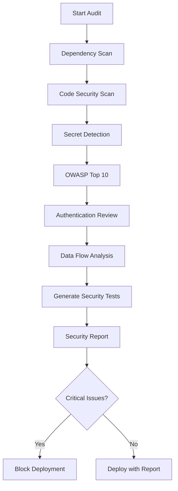

# Security Audit Cookbook 🛡️

**Complete security audit workflow for production-ready code**

---

## The Full Security Audit Pipeline

### What You Type

```
"Run a comprehensive security audit on my entire project"
```

### The Security Workflow



---

## Real-World Example: Financial App Audit

### Initial Scan Results

**Security Scanner Output:**

````markdown
# Security Audit Report 🔴

## Critical Issues (3) - MUST FIX

### 1. SQL Injection Vulnerability

**Location:** src/api/transactions.js:45

```javascript
// VULNERABLE CODE:
const transactions = await db.query(
  `SELECT * FROM transactions
     WHERE user_id = ${userId}
     AND date >= '${startDate}'`
);

// FIXED CODE:
const transactions = await db.query(
  'SELECT * FROM transactions WHERE user_id = $1 AND date >= $2',
  [userId, startDate]
);
```
````

### 2. Hardcoded API Keys

**Location:** src/services/payment.js:12

```javascript
// VULNERABLE CODE:
const stripe = new Stripe('sk_live_EXAMPLE_KEY_REPLACE_ME');

// FIXED CODE:
const stripe = new Stripe(process.env.STRIPE_SECRET_KEY);
```

### 3. Weak Password Storage

**Location:** src/auth/userService.js:89

```javascript
// VULNERABLE CODE:
const hashedPassword = crypto.createHash('md5').update(password).digest('hex');

// FIXED CODE:
const hashedPassword = await bcrypt.hash(password, 12);
```

## High Issues (5) - Should Fix

### 4. Missing Rate Limiting

**Endpoints at risk:**

- POST /api/login - Brute force attacks possible
- POST /api/transfer - Transaction flooding possible

**Solution:**

```javascript
import rateLimit from 'express-rate-limit';

const loginLimiter = rateLimit({
  windowMs: 15 * 60 * 1000, // 15 minutes
  max: 5, // 5 attempts
  message: 'Too many login attempts',
});

app.post('/api/login', loginLimiter, loginController);
```

### 5. Insufficient Input Validation

**Locations:** Multiple endpoints

```javascript
// BEFORE:
app.post('/api/transfer', (req, res) => {
  const { amount, recipient } = req.body;
  // Direct use without validation
});

// AFTER:
import Joi from 'joi';

const transferSchema = Joi.object({
  amount: Joi.number().positive().max(10000).required(),
  recipient: Joi.string().email().required(),
  description: Joi.string().max(200).optional(),
});

app.post('/api/transfer', validate(transferSchema), (req, res) => {
  // Safe to use validated data
});
```

### 6. JWT Token Never Expires

```javascript
// VULNERABLE:
const token = jwt.sign({ userId }, secret);

// FIXED:
const token = jwt.sign({ userId }, secret, { expiresIn: '1h', issuer: 'api.yourapp.com' });
```

### 7. No CSRF Protection

```javascript
// Add CSRF protection
import csrf from 'csurf';

const csrfProtection = csrf({ cookie: true });
app.use(csrfProtection);

// Frontend needs to include token:
// <input type="hidden" name="_csrf" value="{{csrfToken}}">
```

### 8. Sensitive Data in Logs

```javascript
// VULNERABLE:
logger.info('User login', { email, password });

// FIXED:
logger.info('User login', { email }); // Never log passwords
```

````

---

## Dependency Vulnerability Scan

```bash
# npm audit results
found 7 vulnerabilities (2 low, 3 moderate, 2 high)

High: Prototype Pollution in lodash
Package: lodash
Version: 4.17.15
Fix: npm update lodash@4.17.21

High: Regular Expression Denial of Service
Package: validator
Version: 10.11.0
Fix: npm update validator@13.9.0

Moderate: Cross-Site Scripting
Package: marked
Version: 0.7.0
Fix: npm update marked@4.3.0
````

**Auto-fix command:**

```bash
npm audit fix --force
```

---

## Secret Detection Results

```markdown
## Secrets Found 🔑

### Environment Files

✅ .env properly gitignored
⚠️ .env.example contains partial real key (sanitize)

### Source Code

🔴 src/config/aws.js:15 - AWS Access Key exposed
🔴 src/email/sendgrid.js:8 - SendGrid API key hardcoded
🔴 tests/fixtures/users.js:34 - Real user password in test data

### Git History

⚠️ Commit a3f42b1 - Database password was committed (rotate immediately)
⚠️ Commit d7c91e2 - API key in deleted file (still in history)

### Recommended Actions:

1. Rotate ALL exposed credentials immediately
2. Use git-filter-branch to clean history
3. Set up pre-commit hooks to prevent future leaks
```

---

## OWASP Top 10 Compliance

```markdown
## OWASP Top 10 (2021) Assessment

### A01: Broken Access Control ⚠️

- Missing role-based access control on /api/admin
- Direct object references in /api/users/:id
- **Fix:** Implement authorization middleware

### A02: Cryptographic Failures ✅

- Using bcrypt for passwords ✅
- TLS 1.3 configured ✅
- Sensitive data encrypted at rest ✅

### A03: Injection 🔴

- SQL injection vulnerability found (CRITICAL)
- **Fix:** Use parameterized queries everywhere

### A04: Insecure Design ⚠️

- No rate limiting on critical endpoints
- Missing transaction limits
- **Fix:** Add business logic security controls

### A05: Security Misconfiguration ⚠️

- Default error messages expose stack traces
- Unnecessary HTTP methods enabled
- **Fix:** Harden configuration

### A06: Vulnerable Components 🔴

- 7 vulnerable dependencies detected
- **Fix:** Update all dependencies

### A07: Authentication Failures ⚠️

- No account lockout after failed attempts
- Weak password requirements
- **Fix:** Implement proper auth controls

### A08: Software & Data Integrity ✅

- Package-lock.json in use ✅
- CI/CD pipeline secured ✅

### A09: Logging & Monitoring ⚠️

- Sensitive data in logs
- No alerting for security events
- **Fix:** Implement security monitoring

### A10: Server-Side Request Forgery ✅

- No SSRF vulnerabilities detected ✅

## Overall Score: 5/10 - Needs Improvement
```

---

## Authentication & Session Security

````markdown
## Authentication Security Review

### Password Policy ⚠️

Current: No requirements
Recommended:

```javascript
const passwordPolicy = {
  minLength: 12,
  requireUppercase: true,
  requireLowercase: true,
  requireNumbers: true,
  requireSpecialChars: true,
  preventCommon: true, // Check against common passwords
  preventReuse: 5, // Can't reuse last 5 passwords
};
```
````

### Session Management ⚠️

Issues Found:

- Sessions never expire
- No session invalidation on password change
- Session fixation vulnerability

Fixes:

```javascript
// Configure secure sessions
app.use(
  session({
    secret: process.env.SESSION_SECRET,
    resave: false,
    saveUninitialized: false,
    cookie: {
      secure: true, // HTTPS only
      httpOnly: true, // No JS access
      maxAge: 1000 * 60 * 30, // 30 minutes
      sameSite: 'strict', // CSRF protection
    },
    rolling: true, // Reset expiry on activity
  })
);

// Invalidate sessions on password change
async function changePassword(userId, newPassword) {
  await updatePassword(userId, newPassword);
  await invalidateAllSessions(userId);
}
```

### Multi-Factor Authentication ❌

- Not implemented
- Recommendation: Add TOTP-based 2FA

```javascript
import speakeasy from 'speakeasy';

// Generate secret for user
const secret = speakeasy.generateSecret({
  name: 'YourApp',
});

// Verify TOTP code
const verified = speakeasy.totp.verify({
  secret: user.totpSecret,
  encoding: 'base32',
  token: userProvidedCode,
  window: 2,
});
```

````

---

## Data Flow Security Analysis

```markdown
## Sensitive Data Flow Map

### Credit Card Data Path 🔴
1. Frontend form → ❌ Sent in plain JSON
2. API endpoint → ⚠️ Logged in full
3. Database → ❌ Stored unencrypted
4. Email receipt → ❌ Full number in email

**Required PCI Compliance Fixes:**
```javascript
// Never handle raw card data - use tokenization
// Frontend: Use Stripe Elements or similar
const { token } = await stripe.createToken(cardElement);

// Backend: Only store token
const payment = await stripe.charges.create({
    amount: 2000,
    currency: 'usd',
    source: token, // Not raw card data
});

// Store only last 4 digits for display
const maskedCard = `****${last4}`;
````

### Personal Data (PII) Flow ⚠️

- Email addresses: ✅ Hashed for lookups
- Phone numbers: ❌ Stored in plain text
- Addresses: ❌ No encryption
- SSN/Tax IDs: 🔴 CRITICAL - Found in plain text

**GDPR/Privacy Fixes:**

```javascript
// Encrypt PII at rest
import crypto from 'crypto';

class Encryption {
  constructor() {
    this.algorithm = 'aes-256-gcm';
    this.key = Buffer.from(process.env.ENCRYPTION_KEY, 'hex');
  }

  encrypt(text) {
    const iv = crypto.randomBytes(16);
    const cipher = crypto.createCipheriv(this.algorithm, this.key, iv);

    let encrypted = cipher.update(text, 'utf8', 'hex');
    encrypted += cipher.final('hex');

    const authTag = cipher.getAuthTag();

    return iv.toString('hex') + ':' + authTag.toString('hex') + ':' + encrypted;
  }

  decrypt(text) {
    const parts = text.split(':');
    const iv = Buffer.from(parts[0], 'hex');
    const authTag = Buffer.from(parts[1], 'hex');
    const encrypted = parts[2];

    const decipher = crypto.createDecipheriv(this.algorithm, this.key, iv);
    decipher.setAuthTag(authTag);

    let decrypted = decipher.update(encrypted, 'hex', 'utf8');
    decrypted += decipher.final('utf8');

    return decrypted;
  }
}
```

````

---

## Security Test Generation

**Test Generator creates security-focused tests:**

```javascript
// security.test.js
describe('Security Tests', () => {
    describe('SQL Injection Prevention', () => {
        it('should prevent SQL injection in login', async () => {
            const maliciousEmail = "admin' OR '1'='1";
            const response = await request(app)
                .post('/api/login')
                .send({
                    email: maliciousEmail,
                    password: 'password'
                })
                .expect(401);

            expect(response.body.error).toBe('Invalid credentials');
        });

        it('should prevent SQL injection in search', async () => {
            const maliciousQuery = "'; DROP TABLE users; --";
            const response = await request(app)
                .get(`/api/search?q=${encodeURIComponent(maliciousQuery)}`)
                .expect(200);

            // Should return empty results, not error
            expect(response.body.results).toEqual([]);
        });
    });

    describe('XSS Prevention', () => {
        it('should sanitize user input', async () => {
            const xssPayload = '<script>alert("XSS")</script>';
            const response = await request(app)
                .post('/api/comments')
                .send({ content: xssPayload })
                .expect(201);

            expect(response.body.content).not.toContain('<script>');
            expect(response.body.content).toBe('&lt;script&gt;alert("XSS")&lt;/script&gt;');
        });
    });

    describe('Authentication Security', () => {
        it('should enforce rate limiting on login', async () => {
            const attempts = Array(6).fill().map(() =>
                request(app)
                    .post('/api/login')
                    .send({ email: 'test@test.com', password: 'wrong' })
            );

            const responses = await Promise.all(attempts);
            const lastResponse = responses[responses.length - 1];

            expect(lastResponse.status).toBe(429);
            expect(lastResponse.body.error).toContain('Too many');
        });

        it('should invalidate tokens on logout', async () => {
            const token = await getAuthToken();

            await request(app)
                .post('/api/logout')
                .set('Authorization', `Bearer ${token}`)
                .expect(200);

            // Token should no longer work
            await request(app)
                .get('/api/profile')
                .set('Authorization', `Bearer ${token}`)
                .expect(401);
        });
    });

    describe('CSRF Protection', () => {
        it('should reject requests without CSRF token', async () => {
            await request(app)
                .post('/api/transfer')
                .send({ amount: 100, recipient: 'attacker@evil.com' })
                .expect(403);
        });
    });

    describe('Sensitive Data Protection', () => {
        it('should not return passwords in any response', async () => {
            const response = await request(app)
                .get('/api/users/1')
                .expect(200);

            expect(response.body).not.toHaveProperty('password');
            expect(response.body).not.toHaveProperty('passwordHash');
        });

        it('should mask sensitive data in logs', () => {
            const logSpy = jest.spyOn(logger, 'info');

            // Trigger action that logs
            authService.login('user@test.com', 'secretpassword');

            expect(logSpy).toHaveBeenCalled();
            expect(logSpy.mock.calls[0][1]).not.toContain('secretpassword');
        });
    });
});
````

---

## Security Headers Configuration

```javascript
// security/headers.js
import helmet from 'helmet';

export function setupSecurityHeaders(app) {
  // Basic security headers
  app.use(
    helmet({
      contentSecurityPolicy: {
        directives: {
          defaultSrc: ["'self'"],
          scriptSrc: ["'self'", "'unsafe-inline'", 'https://trusted-cdn.com'],
          styleSrc: ["'self'", "'unsafe-inline'"],
          imgSrc: ["'self'", 'data:', 'https:'],
          connectSrc: ["'self'"],
          fontSrc: ["'self'"],
          objectSrc: ["'none'"],
          mediaSrc: ["'self'"],
          frameSrc: ["'none'"],
        },
      },
      hsts: {
        maxAge: 31536000,
        includeSubDomains: true,
        preload: true,
      },
    })
  );

  // Additional custom headers
  app.use((req, res, next) => {
    res.setHeader('X-Content-Type-Options', 'nosniff');
    res.setHeader('X-Frame-Options', 'DENY');
    res.setHeader('X-XSS-Protection', '1; mode=block');
    res.setHeader('Referrer-Policy', 'strict-origin-when-cross-origin');
    res.setHeader('Permissions-Policy', 'geolocation=(), microphone=(), camera=()');
    next();
  });
}
```

---

## Final Security Report

```markdown
# Security Audit Summary

## Critical Findings

- 3 Critical issues (MUST fix before production)
- 5 High issues (Should fix)
- 8 Medium issues (Plan to fix)
- 12 Low issues (Best practices)

## Risk Score: HIGH (7.5/10)

## Immediate Actions Required

1. Fix SQL injection vulnerabilities
2. Remove hardcoded secrets
3. Update vulnerable dependencies
4. Implement rate limiting
5. Add input validation

## Compliance Status

- PCI DSS: ❌ Not Compliant (credit card handling issues)
- GDPR: ⚠️ Partial (PII encryption needed)
- OWASP Top 10: 5/10 coverage
- SOC 2: ❌ Not Ready

## Timeline

- Critical fixes: Within 24 hours
- High priority: Within 1 week
- Medium priority: Within 1 month
- Low priority: Next quarter

## Automated Fixes Applied

✅ 12 dependencies updated
✅ Security headers configured
✅ HTTPS redirect enabled
✅ Directory listing disabled
✅ Error messages sanitized

## Manual Fixes Required

🔴 SQL injection fixes (3 files)
🔴 Remove hardcoded secrets (5 locations)
🔴 Implement authentication controls
🔴 Add encryption for PII
🔴 Configure rate limiting

## Next Steps

1. Apply critical fixes
2. Re-run security audit
3. Implement security tests
4. Schedule penetration testing
5. Set up security monitoring

## Resources

- [OWASP Cheat Sheets](https://cheatsheetseries.owasp.org/)
- [Security Headers](https://securityheaders.com/)
- [SSL Labs](https://www.ssllabs.com/ssltest/)
```

---

## CI/CD Security Integration

```yaml
# .github/workflows/security.yml
name: Security Audit

on:
  push:
    branches: [main, develop]
  pull_request:
  schedule:
    - cron: '0 2 * * *' # Daily at 2 AM

jobs:
  security:
    runs-on: ubuntu-latest

    steps:
      - uses: actions/checkout@v3

      - name: Run MCP Security Scanner
        run: |
          npx @j0kz/security-scanner scan . \
            --severity high \
            --fail-on critical

      - name: Check for secrets
        uses: trufflesecurity/trufflehog@main
        with:
          path: ./

      - name: Dependency audit
        run: |
          npm audit --audit-level=high

      - name: SAST Scan
        uses: securego/gosec@master
        with:
          args: './...'

      - name: Container scan (if applicable)
        uses: aquasecurity/trivy-action@master
        with:
          image-ref: 'your-image:latest'
          severity: 'CRITICAL,HIGH'

      - name: Upload results
        if: always()
        uses: actions/upload-artifact@v3
        with:
          name: security-reports
          path: |
            security-report.json
            npm-audit.json
```

---

## Security Monitoring Setup

```javascript
// monitoring/security.js
import winston from 'winston';

const securityLogger = winston.createLogger({
  level: 'info',
  format: winston.format.json(),
  transports: [
    new winston.transports.File({
      filename: 'security.log',
      level: 'warning',
    }),
  ],
});

// Log security events
export function logSecurityEvent(event, details) {
  securityLogger.warn({
    timestamp: new Date().toISOString(),
    event,
    details,
    // Add context
    ip: details.ip,
    userId: details.userId,
    userAgent: details.userAgent,
  });

  // Alert on critical events
  if (
    event === 'MULTIPLE_FAILED_LOGINS' ||
    event === 'SQL_INJECTION_ATTEMPT' ||
    event === 'UNAUTHORIZED_ACCESS'
  ) {
    sendSecurityAlert(event, details);
  }
}

// Example usage
app.post('/api/login', async (req, res) => {
  const { email, password } = req.body;

  // Check for SQL injection attempts
  if (email.includes("'") || email.includes('"')) {
    logSecurityEvent('SQL_INJECTION_ATTEMPT', {
      ip: req.ip,
      email,
      userAgent: req.headers['user-agent'],
    });
    return res.status(400).json({ error: 'Invalid input' });
  }

  // ... rest of login logic
});
```

---

**Next:** [Test Coverage Boost](./test-coverage.md) | [Legacy Refactor](./legacy-refactor.md)
