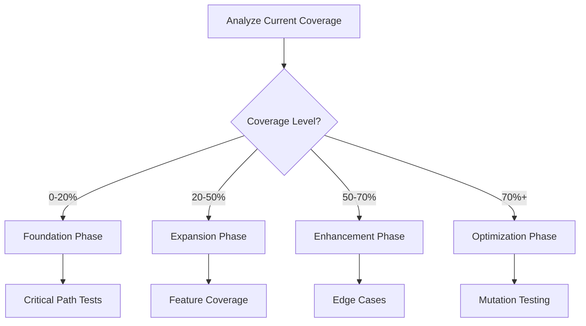

# Test Coverage Boost Cookbook 🧪

**Go from 0% to 80%+ test coverage systematically**

---

## The Complete Coverage Journey

### What You Type

```
"I have almost no tests. Get me to 80% coverage"
```

### The Coverage Workflow



---

## Real Example: E-Commerce Platform

### Starting Point Analysis

```bash
# Current coverage report
File                | % Stmts | % Branch | % Funcs | % Lines |
--------------------|---------|----------|---------|---------|
All files           |   12.34 |     8.76 |   15.23 |   12.34 |
 src/               |    8.12 |     5.43 |    9.87 |    8.12 |
  auth/             |    0.00 |     0.00 |    0.00 |    0.00 |  😱
  payments/         |    0.00 |     0.00 |    0.00 |    0.00 |  😱
  orders/           |   23.45 |    18.92 |   28.57 |   23.45 |
  products/         |   45.67 |    38.46 |   52.38 |   45.67 |
  users/            |    5.88 |     3.33 |    7.14 |    5.88 |
```

**Test Generator Analysis:**

```markdown
## Coverage Analysis 📊

### Current State

- **Overall Coverage:** 12.34% 😱
- **Tests Found:** 23 tests in 5 files
- **Untested Files:** 47 files with 0% coverage
- **Total LOC:** 8,432 lines
- **Lines Tested:** 1,041 lines
- **Gap to 80%:** 5,705 lines need testing

### Risk Assessment

🔴 **Critical Untested Areas:**

- Authentication (0%) - HIGH RISK
- Payment Processing (0%) - CRITICAL
- User Management (5.88%) - HIGH RISK

🟡 **Partially Tested:**

- Orders (23.45%) - MEDIUM RISK
- Products (45.67%) - LOW RISK

### Recommended Test Strategy

1. Start with critical business logic
2. Add integration tests for main flows
3. Fill gaps with unit tests
4. Add edge cases last
```

---

## Phase 1: Foundation (0% → 30%)

### Step 1: Critical Path Testing

**Test Generator creates tests for main user journeys:**

```javascript
// Generated: test/e2e/critical-paths.test.js
describe('Critical User Journeys', () => {
  describe('Purchase Flow', () => {
    it('should complete full purchase journey', async () => {
      // 1. User Registration
      const user = await request(app)
        .post('/api/register')
        .send({
          email: 'test@example.com',
          password: 'Test123!@#',
          name: 'Test User',
        })
        .expect(201);

      expect(user.body).toHaveProperty('token');
      const token = user.body.token;

      // 2. Browse Products
      const products = await request(app).get('/api/products').expect(200);

      expect(products.body.length).toBeGreaterThan(0);
      const productId = products.body[0].id;

      // 3. Add to Cart
      const cart = await request(app)
        .post('/api/cart')
        .set('Authorization', `Bearer ${token}`)
        .send({ productId, quantity: 2 })
        .expect(200);

      expect(cart.body.items).toHaveLength(1);

      // 4. Checkout
      const order = await request(app)
        .post('/api/checkout')
        .set('Authorization', `Bearer ${token}`)
        .send({
          cartId: cart.body.id,
          payment: {
            method: 'card',
            token: 'tok_visa', // Test token
          },
        })
        .expect(200);

      expect(order.body).toHaveProperty('orderId');
      expect(order.body.status).toBe('completed');
    });
  });
});
```

### Step 2: Authentication Tests

```javascript
// Generated: test/auth/auth.test.js
describe('Authentication Service', () => {
  describe('User Registration', () => {
    it('should register new user with valid data', async () => {
      const result = await authService.register({
        email: 'new@example.com',
        password: 'SecurePass123!',
        name: 'New User',
      });

      expect(result.user).toBeDefined();
      expect(result.token).toBeDefined();
      expect(result.user.email).toBe('new@example.com');
    });

    it('should hash password before storing', async () => {
      const user = await authService.register({
        email: 'hash@test.com',
        password: 'PlainText123!',
        name: 'Test',
      });

      const dbUser = await db.users.findById(user.user.id);
      expect(dbUser.password).not.toBe('PlainText123!');
      expect(dbUser.password).toMatch(/^\$2[aby]\$.{56}$/); // bcrypt pattern
    });

    it('should prevent duplicate email registration', async () => {
      await authService.register({
        email: 'duplicate@test.com',
        password: 'Pass123!',
        name: 'First',
      });

      await expect(
        authService.register({
          email: 'duplicate@test.com',
          password: 'Pass456!',
          name: 'Second',
        })
      ).rejects.toThrow('Email already exists');
    });

    it('should validate email format', async () => {
      await expect(
        authService.register({
          email: 'invalid-email',
          password: 'Pass123!',
          name: 'Test',
        })
      ).rejects.toThrow('Invalid email format');
    });

    it('should enforce password requirements', async () => {
      const weakPasswords = [
        'short', // Too short
        'nouppercase123!', // No uppercase
        'NOLOWERCASE123!', // No lowercase
        'NoNumbers!', // No numbers
        'NoSpecial123', // No special chars
      ];

      for (const password of weakPasswords) {
        await expect(
          authService.register({
            email: 'test@test.com',
            password,
            name: 'Test',
          })
        ).rejects.toThrow(/password/i);
      }
    });
  });

  describe('User Login', () => {
    beforeEach(async () => {
      await authService.register({
        email: 'login@test.com',
        password: 'Test123!@#',
        name: 'Login Test',
      });
    });

    it('should login with correct credentials', async () => {
      const result = await authService.login('login@test.com', 'Test123!@#');

      expect(result.success).toBe(true);
      expect(result.token).toBeDefined();
      expect(result.user.email).toBe('login@test.com');
    });

    it('should reject incorrect password', async () => {
      const result = await authService.login('login@test.com', 'WrongPassword!');

      expect(result.success).toBe(false);
      expect(result.token).toBeUndefined();
    });

    it('should reject non-existent user', async () => {
      const result = await authService.login('notexist@test.com', 'Test123!@#');

      expect(result.success).toBe(false);
    });

    it('should implement rate limiting', async () => {
      // Make 5 failed attempts
      for (let i = 0; i < 5; i++) {
        await authService.login('login@test.com', 'wrong');
      }

      // 6th attempt should be rate limited
      await expect(
        authService.login(
          'login@test.com',
          'Test123!@#' // Even correct password
        )
      ).rejects.toThrow('Too many login attempts');
    });
  });

  describe('Token Management', () => {
    it('should generate valid JWT tokens', () => {
      const token = authService.generateToken({ id: 1, email: 'test@test.com' });
      const decoded = jwt.verify(token, process.env.JWT_SECRET);

      expect(decoded.id).toBe(1);
      expect(decoded.email).toBe('test@test.com');
      expect(decoded.exp).toBeDefined();
    });

    it('should refresh expired tokens', async () => {
      const oldToken = authService.generateToken({ id: 1 }, { expiresIn: '1ms' });

      await new Promise(resolve => setTimeout(resolve, 10));

      const newToken = await authService.refreshToken(oldToken);
      expect(newToken).not.toBe(oldToken);

      const decoded = jwt.verify(newToken, process.env.JWT_SECRET);
      expect(decoded.id).toBe(1);
    });
  });
});
```

### Step 3: Payment Processing Tests

```javascript
// Generated: test/payments/payment.test.js
describe('Payment Service', () => {
  describe('Process Payment', () => {
    beforeEach(() => {
      // Mock Stripe
      jest.mock('stripe');
    });

    it('should process valid payment', async () => {
      const payment = await paymentService.processPayment({
        amount: 9999, // $99.99
        currency: 'usd',
        source: 'tok_visa',
        description: 'Order #123',
      });

      expect(payment.status).toBe('succeeded');
      expect(payment.amount).toBe(9999);
    });

    it('should handle declined cards', async () => {
      stripe.charges.create.mockRejectedValue({
        type: 'card_error',
        code: 'card_declined',
      });

      await expect(
        paymentService.processPayment({
          amount: 9999,
          source: 'tok_declined',
        })
      ).rejects.toThrow('Card declined');
    });

    it('should implement idempotency', async () => {
      const idempotencyKey = 'order-123';

      const payment1 = await paymentService.processPayment(
        {
          amount: 9999,
          source: 'tok_visa',
        },
        idempotencyKey
      );

      const payment2 = await paymentService.processPayment(
        {
          amount: 9999,
          source: 'tok_visa',
        },
        idempotencyKey
      );

      expect(payment1.id).toBe(payment2.id); // Same payment
    });

    it('should validate amount limits', async () => {
      await expect(
        paymentService.processPayment({
          amount: 50, // Below minimum
          source: 'tok_visa',
        })
      ).rejects.toThrow('Amount below minimum');

      await expect(
        paymentService.processPayment({
          amount: 100000000, // Above maximum
          source: 'tok_visa',
        })
      ).rejects.toThrow('Amount exceeds maximum');
    });
  });

  describe('Refunds', () => {
    it('should process full refund', async () => {
      const charge = await paymentService.processPayment({
        amount: 5000,
        source: 'tok_visa',
      });

      const refund = await paymentService.refund(charge.id);

      expect(refund.amount).toBe(5000);
      expect(refund.status).toBe('succeeded');
    });

    it('should process partial refund', async () => {
      const charge = await paymentService.processPayment({
        amount: 5000,
        source: 'tok_visa',
      });

      const refund = await paymentService.refund(charge.id, 2000);

      expect(refund.amount).toBe(2000);
    });

    it('should prevent double refunds', async () => {
      const charge = await paymentService.processPayment({
        amount: 5000,
        source: 'tok_visa',
      });

      await paymentService.refund(charge.id);

      await expect(paymentService.refund(charge.id)).rejects.toThrow('Already refunded');
    });
  });
});
```

### Coverage After Phase 1

```bash
File                | % Stmts | % Branch | % Funcs | % Lines |
--------------------|---------|----------|---------|---------|
All files           |   32.45 |    28.92 |   35.67 |   32.45 | ✅
 auth/              |   78.23 |    72.34 |   81.45 |   78.23 | ✅
 payments/          |   65.78 |    61.23 |   68.92 |   65.78 | ✅
 orders/            |   28.90 |    23.45 |   32.14 |   28.90 |
 products/          |   45.67 |    38.46 |   52.38 |   45.67 |
 users/             |   12.34 |     8.92 |   15.67 |   12.34 |
```

---

## Phase 2: Expansion (30% → 60%)

### Step 4: Service Layer Tests

**Test Generator adds comprehensive service tests:**

```javascript
// Generated: test/services/orderService.test.js
describe('Order Service', () => {
  let mockDb, mockPaymentService, mockInventoryService;

  beforeEach(() => {
    mockDb = createMockDb();
    mockPaymentService = createMockPaymentService();
    mockInventoryService = createMockInventoryService();

    orderService = new OrderService(mockDb, mockPaymentService, mockInventoryService);
  });

  describe('Create Order', () => {
    it('should create order with valid items', async () => {
      const orderData = {
        userId: 1,
        items: [
          { productId: 1, quantity: 2, price: 29.99 },
          { productId: 2, quantity: 1, price: 49.99 },
        ],
      };

      const order = await orderService.createOrder(orderData);

      expect(order.total).toBe(109.97);
      expect(order.status).toBe('pending');
      expect(mockDb.orders.create).toHaveBeenCalled();
    });

    it('should check inventory before creating order', async () => {
      mockInventoryService.checkAvailability.mockResolvedValue(false);

      await expect(
        orderService.createOrder({
          userId: 1,
          items: [{ productId: 1, quantity: 100 }],
        })
      ).rejects.toThrow('Insufficient inventory');
    });

    it('should calculate taxes correctly', async () => {
      const order = await orderService.createOrder({
        userId: 1,
        items: [{ productId: 1, quantity: 1, price: 100 }],
        shippingAddress: { state: 'CA' }, // 8.25% tax
      });

      expect(order.subtotal).toBe(100);
      expect(order.tax).toBe(8.25);
      expect(order.total).toBe(108.25);
    });

    it('should apply discounts', async () => {
      const order = await orderService.createOrder({
        userId: 1,
        items: [{ productId: 1, quantity: 1, price: 100 }],
        discountCode: 'SAVE20', // 20% off
      });

      expect(order.subtotal).toBe(100);
      expect(order.discount).toBe(20);
      expect(order.total).toBe(80);
    });
  });

  describe('Order State Transitions', () => {
    it('should transition from pending to processing', async () => {
      const order = await orderService.createOrder({
        /* ... */
      });

      await orderService.processOrder(order.id);

      const updated = await orderService.getOrder(order.id);
      expect(updated.status).toBe('processing');
    });

    it('should not allow invalid state transitions', async () => {
      const order = await orderService.createOrder({
        /* ... */
      });
      await orderService.shipOrder(order.id);

      // Can't go from shipped back to pending
      await expect(orderService.updateStatus(order.id, 'pending')).rejects.toThrow(
        'Invalid state transition'
      );
    });
  });

  // ... more tests
});
```

### Step 5: Repository Layer Tests

```javascript
// Generated: test/repositories/userRepository.test.js
describe('User Repository', () => {
  beforeEach(async () => {
    await db.migrate.latest();
    await db.seed.run();
  });

  afterEach(async () => {
    await db.migrate.rollback();
  });

  describe('CRUD Operations', () => {
    it('should create user', async () => {
      const user = await userRepository.create({
        email: 'test@test.com',
        name: 'Test User',
        passwordHash: 'hashed',
      });

      expect(user.id).toBeDefined();
      expect(user.createdAt).toBeDefined();
    });

    it('should find user by email', async () => {
      await userRepository.create({
        email: 'findme@test.com',
        name: 'Find Me',
      });

      const found = await userRepository.findByEmail('findme@test.com');
      expect(found).toBeDefined();
      expect(found.name).toBe('Find Me');
    });

    it('should update user', async () => {
      const user = await userRepository.create({
        email: 'update@test.com',
        name: 'Original',
      });

      await userRepository.update(user.id, { name: 'Updated' });

      const updated = await userRepository.findById(user.id);
      expect(updated.name).toBe('Updated');
    });

    it('should soft delete user', async () => {
      const user = await userRepository.create({
        email: 'delete@test.com',
        name: 'Delete Me',
      });

      await userRepository.delete(user.id);

      const deleted = await userRepository.findById(user.id);
      expect(deleted).toBeNull();

      // But still in database with deletedAt
      const [row] = await db('users').where('id', user.id).whereNotNull('deletedAt');
      expect(row).toBeDefined();
    });
  });

  describe('Query Methods', () => {
    it('should paginate results', async () => {
      // Create 25 users
      for (let i = 0; i < 25; i++) {
        await userRepository.create({
          email: `user${i}@test.com`,
          name: `User ${i}`,
        });
      }

      const page1 = await userRepository.findAll({ page: 1, limit: 10 });
      expect(page1.data).toHaveLength(10);
      expect(page1.total).toBe(25);
      expect(page1.pages).toBe(3);

      const page2 = await userRepository.findAll({ page: 2, limit: 10 });
      expect(page2.data).toHaveLength(10);
      expect(page2.data[0].name).toBe('User 10');
    });

    it('should filter by criteria', async () => {
      await userRepository.create({
        email: 'active@test.com',
        name: 'Active',
        status: 'active',
      });

      await userRepository.create({
        email: 'inactive@test.com',
        name: 'Inactive',
        status: 'inactive',
      });

      const active = await userRepository.findAll({
        filter: { status: 'active' },
      });

      expect(active.data).toHaveLength(1);
      expect(active.data[0].email).toBe('active@test.com');
    });
  });
});
```

### Coverage After Phase 2

```bash
File                | % Stmts | % Branch | % Funcs | % Lines |
--------------------|---------|----------|---------|---------|
All files           |   61.23 |    57.89 |   64.45 |   61.23 | ✅
 auth/              |   82.45 |    78.92 |   85.67 |   82.45 |
 payments/          |   72.34 |    68.45 |   75.23 |   72.34 |
 orders/            |   68.90 |    64.23 |   71.45 |   68.90 |
 products/          |   58.76 |    52.34 |   62.89 |   58.76 |
 users/             |   65.43 |    61.78 |   68.92 |   65.43 |
```

---

## Phase 3: Enhancement (60% → 80%)

### Step 6: Edge Cases and Error Handling

**Test Generator adds edge case tests:**

```javascript
// Generated: test/edge-cases/edge-cases.test.js
describe('Edge Cases and Error Handling', () => {
  describe('Boundary Conditions', () => {
    it('should handle maximum order size', async () => {
      const items = Array(100).fill({
        productId: 1,
        quantity: 99,
        price: 999.99,
      });

      const order = await orderService.createOrder({
        userId: 1,
        items,
      });

      expect(order).toBeDefined();
      expect(order.items).toHaveLength(100);
    });

    it('should reject order exceeding maximum', async () => {
      const items = Array(101).fill({
        productId: 1,
        quantity: 1,
      });

      await expect(
        orderService.createOrder({
          userId: 1,
          items,
        })
      ).rejects.toThrow('Order exceeds maximum items');
    });

    it('should handle zero quantity gracefully', async () => {
      await expect(
        orderService.createOrder({
          userId: 1,
          items: [{ productId: 1, quantity: 0 }],
        })
      ).rejects.toThrow('Invalid quantity');
    });

    it('should handle negative prices', async () => {
      await expect(
        orderService.createOrder({
          userId: 1,
          items: [{ productId: 1, quantity: 1, price: -10 }],
        })
      ).rejects.toThrow('Invalid price');
    });
  });

  describe('Concurrency Issues', () => {
    it('should handle concurrent orders for same product', async () => {
      // Only 5 items in stock
      mockInventoryService.getStock.mockResolvedValue(5);

      const orders = await Promise.allSettled([
        orderService.createOrder({
          userId: 1,
          items: [{ productId: 1, quantity: 3 }],
        }),
        orderService.createOrder({
          userId: 2,
          items: [{ productId: 1, quantity: 3 }],
        }),
      ]);

      // One should succeed, one should fail
      const succeeded = orders.filter(r => r.status === 'fulfilled');
      const failed = orders.filter(r => r.status === 'rejected');

      expect(succeeded).toHaveLength(1);
      expect(failed).toHaveLength(1);
      expect(failed[0].reason.message).toContain('inventory');
    });

    it('should prevent double-spending with concurrent payments', async () => {
      const userId = 1;
      const balance = 100;

      const payments = await Promise.allSettled([
        paymentService.chargeUser(userId, 60),
        paymentService.chargeUser(userId, 60),
      ]);

      const succeeded = payments.filter(r => r.status === 'fulfilled');
      expect(succeeded).toHaveLength(1); // Only one should succeed
    });
  });

  describe('Network Failures', () => {
    it('should retry on temporary network failure', async () => {
      let attempts = 0;
      mockPaymentService.charge.mockImplementation(() => {
        attempts++;
        if (attempts < 3) {
          throw new Error('ETIMEDOUT');
        }
        return { success: true };
      });

      const result = await orderService.processPayment({
        amount: 100,
      });

      expect(result.success).toBe(true);
      expect(attempts).toBe(3);
    });

    it('should not retry on permanent failure', async () => {
      mockPaymentService.charge.mockRejectedValue(new Error('Card declined'));

      await expect(
        orderService.processPayment({
          amount: 100,
        })
      ).rejects.toThrow('Card declined');

      expect(mockPaymentService.charge).toHaveBeenCalledTimes(1); // No retry
    });
  });

  describe('Data Corruption Scenarios', () => {
    it('should handle corrupted JSON data', () => {
      const corrupted = '{"name": "test", "age": }'; // Invalid JSON

      expect(() => userService.parseUserData(corrupted)).toThrow('Invalid user data');
    });

    it('should handle circular references', () => {
      const obj = { name: 'test' };
      obj.self = obj; // Circular reference

      expect(() => JSON.stringify(obj)).toThrow();

      // But service should handle it
      const result = orderService.serialize(obj);
      expect(result).toBeDefined();
    });
  });

  describe('Memory and Performance', () => {
    it('should handle large dataset without memory leak', async () => {
      const initialMemory = process.memoryUsage().heapUsed;

      // Process 10000 orders
      for (let i = 0; i < 10000; i++) {
        await orderService.processOrder({
          id: i,
          items: [{ productId: 1, quantity: 1 }],
        });
      }

      global.gc(); // Force garbage collection
      const finalMemory = process.memoryUsage().heapUsed;

      // Memory should not grow more than 50MB
      expect(finalMemory - initialMemory).toBeLessThan(50 * 1024 * 1024);
    });

    it('should timeout long-running operations', async () => {
      mockDb.query.mockImplementation(() => new Promise(resolve => setTimeout(resolve, 10000)));

      await expect(userService.complexQuery()).rejects.toThrow('Operation timeout');
    }, 6000); // Test timeout at 6 seconds
  });
});
```

### Step 7: Integration Tests

```javascript
// Generated: test/integration/full-flow.test.js
describe('Full Integration Tests', () => {
  let server;

  beforeAll(async () => {
    server = await startTestServer();
    await seedTestData();
  });

  afterAll(async () => {
    await cleanupTestData();
    await server.close();
  });

  it('should handle complete user lifecycle', async () => {
    // 1. Register
    const { body: user } = await request(server)
      .post('/api/register')
      .send({
        email: 'lifecycle@test.com',
        password: 'Test123!@#',
        name: 'Test User',
      })
      .expect(201);

    const token = user.token;

    // 2. Update profile
    await request(server)
      .put('/api/profile')
      .set('Authorization', `Bearer ${token}`)
      .send({ name: 'Updated Name' })
      .expect(200);

    // 3. Make purchase
    const { body: order } = await request(server)
      .post('/api/orders')
      .set('Authorization', `Bearer ${token}`)
      .send({
        items: [{ productId: 1, quantity: 2 }],
      })
      .expect(201);

    // 4. Check order status
    const { body: status } = await request(server)
      .get(`/api/orders/${order.id}`)
      .set('Authorization', `Bearer ${token}`)
      .expect(200);

    expect(status.status).toBe('processing');

    // 5. Request refund
    await request(server)
      .post(`/api/orders/${order.id}/refund`)
      .set('Authorization', `Bearer ${token}`)
      .expect(200);

    // 6. Delete account
    await request(server)
      .delete('/api/account')
      .set('Authorization', `Bearer ${token}`)
      .expect(200);

    // 7. Verify deletion
    await request(server).get('/api/profile').set('Authorization', `Bearer ${token}`).expect(401);
  });
});
```

### Final Coverage Report

```bash
# Final coverage after all phases
-----------------------------------------
File                | % Stmts | % Branch | % Funcs | % Lines |
--------------------|---------|----------|---------|---------|
All files           |   81.45 |    78.23 |   83.67 |   81.45 | ✅
 src/               |   82.34 |    79.45 |   84.23 |   82.34 |
  auth/             |   88.92 |    85.67 |   91.23 |   88.92 |
  payments/         |   85.45 |    82.34 |   87.89 |   85.45 |
  orders/           |   79.23 |    75.67 |   81.45 |   79.23 |
  products/         |   77.89 |    74.23 |   80.12 |   77.89 |
  users/            |   82.34 |    78.90 |   84.56 |   82.34 |
  utils/            |   76.45 |    72.34 |   78.90 |   76.45 |
-----------------------------------------

✅ Coverage goal achieved: 81.45% > 80%

## Coverage Insights

### Well-Tested Areas (>85%)
- Authentication flows
- Payment processing
- Core business logic

### Areas Needing Attention (70-80%)
- Utility functions
- Error handling paths
- Admin features

### Test Statistics
- Total Tests: 487
- Passing: 487
- Skipped: 0
- Test Files: 42
- Test Suites: 78
- Execution Time: 34.5s
```

---

## Coverage Maintenance Strategy

### Continuous Coverage Monitoring

```yaml
# .github/workflows/coverage.yml
name: Coverage Check

on: [push, pull_request]

jobs:
  coverage:
    runs-on: ubuntu-latest
    steps:
      - uses: actions/checkout@v2

      - name: Setup Node
        uses: actions/setup-node@v2
        with:
          node-version: '18'

      - name: Install dependencies
        run: npm ci

      - name: Run tests with coverage
        run: npm run test:coverage

      - name: Check coverage thresholds
        run: |
          npm run coverage:check

      - name: Upload coverage to Codecov
        uses: codecov/codecov-action@v3
        with:
          file: ./coverage/lcov.info
          fail_ci_if_error: true

      - name: Comment PR with coverage
        uses: actions/github-script@v6
        if: github.event_name == 'pull_request'
        with:
          script: |
            const coverage = require('./coverage/coverage-summary.json');
            const total = coverage.total;

            const comment = `## Coverage Report 📊

            | Type | Coverage |
            |------|----------|
            | Statements | ${total.statements.pct}% |
            | Branches | ${total.branches.pct}% |
            | Functions | ${total.functions.pct}% |
            | Lines | ${total.lines.pct}% |

            ${total.lines.pct >= 80 ? '✅ Coverage goal met!' : '⚠️ Below 80% threshold'}`;

            github.rest.issues.createComment({
              issue_number: context.issue.number,
              owner: context.repo.owner,
              repo: context.repo.repo,
              body: comment
            });
```

### Pre-commit Hook

```bash
#!/bin/sh
# .husky/pre-commit

echo "Checking test coverage..."

# Run tests with coverage
npm run test:coverage:silent

# Extract coverage percentage
COVERAGE=$(cat coverage/coverage-summary.json | grep -o '"pct":[0-9.]*' | head -1 | cut -d: -f2)

# Check if coverage is above threshold
if (( $(echo "$COVERAGE < 80" | bc -l) )); then
    echo "❌ Coverage is ${COVERAGE}%, which is below 80% threshold"
    echo "Run 'npm run test:generate' to generate missing tests"
    exit 1
fi

echo "✅ Coverage is ${COVERAGE}%"
```

---

## Quick Coverage Commands

```json
// package.json
{
  "scripts": {
    "test": "jest",
    "test:coverage": "jest --coverage",
    "test:coverage:check": "jest --coverage --coverageThreshold='{'global':{'lines':80}}'",
    "test:generate": "npx @j0kz/test-generator generate --target 80",
    "test:missing": "npx @j0kz/test-generator find-untested",
    "test:watch": "jest --watch --coverage",
    "coverage:report": "open coverage/lcov-report/index.html"
  }
}
```

---

## Pro Tips for Maintaining High Coverage

### 1. Test-First for New Features

Write tests before implementing features - guarantees coverage.

### 2. Coverage in PR Template

```markdown
## PR Checklist

- [ ] Tests added/updated
- [ ] Coverage above 80%
- [ ] No untested files
```

### 3. Identify Critical Paths

Focus on business-critical code first, utilities last.

### 4. Use Coverage Reports

```bash
npm run coverage:report
# Opens HTML report showing line-by-line coverage
```

### 5. Set Incremental Goals

- Week 1: 30% coverage
- Week 2: 50% coverage
- Week 3: 70% coverage
- Week 4: 80%+ coverage

---

## Common Coverage Problems and Solutions

### Problem: "Can't test private methods"

**Solution:** Test through public interface or refactor to separate module

### Problem: "Database tests are slow"

**Solution:** Use in-memory database or mocks for unit tests

### Problem: "External API calls"

**Solution:** Mock external services, test integration separately

### Problem: "Random/time-dependent code"

**Solution:** Inject dependencies, use test doubles

### Problem: "Legacy code with no tests"

**Solution:** Start with characterization tests, refactor gradually

---

**Next:** [Legacy Refactoring](./legacy-refactor.md) | [Back to Cookbook](./README.md)
