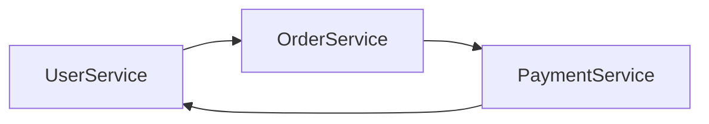
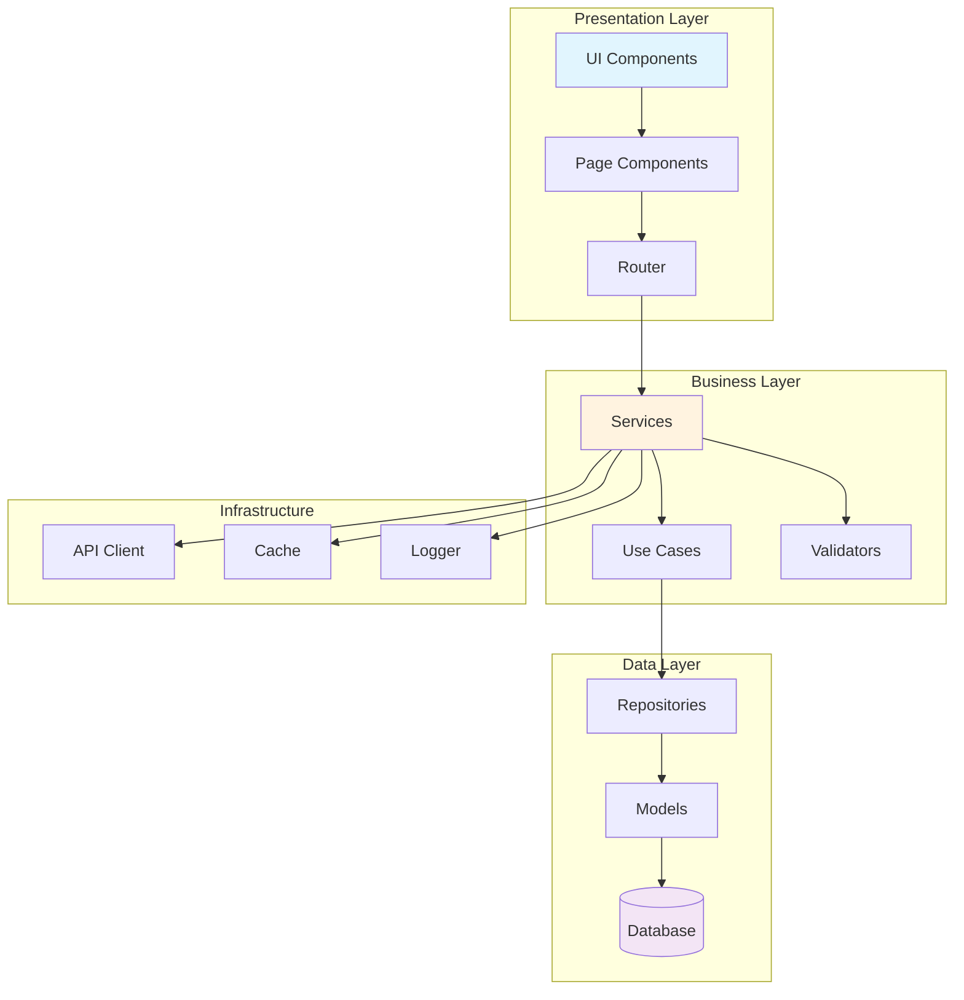
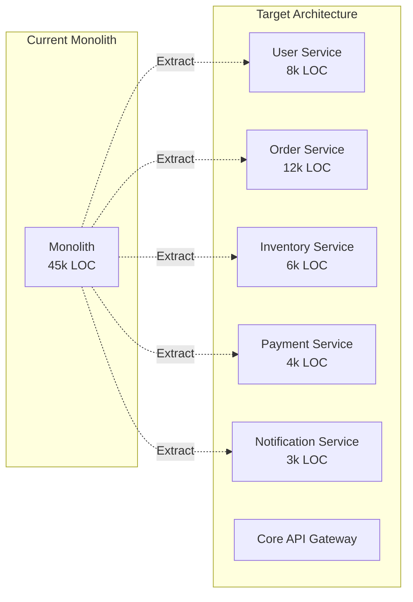
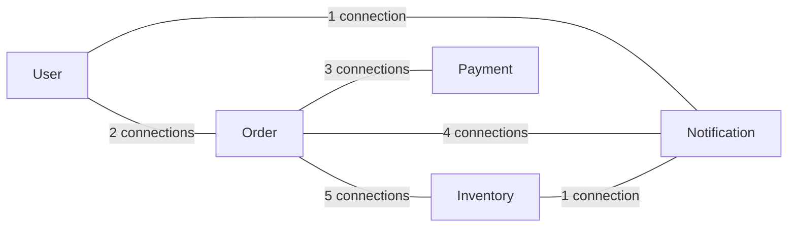

# Architecture Analyzer Examples 🏗️

**Understand, visualize, and improve your system architecture with @j0kz/architecture-analyzer**

---

## Table of Contents
- [Find Circular Dependencies](#circular-deps)
- [Generate Dependency Graphs](#dep-graphs)
- [Check Layer Violations](#layer-violations)
- [Analyze Coupling & Cohesion](#coupling-analysis)
- [Architecture Suggestions](#suggestions)
- [Microservice Boundary Detection](#microservice-detection)
- [Technical Debt Mapping](#debt-mapping)

---

## Find Circular Dependencies {#circular-deps}

### Scenario
Your build times are slow and you suspect circular dependencies.

### What You Type
```
"Find all circular dependencies in my project"
```

### What Architecture Analyzer Finds

```markdown
## Circular Dependencies Detected 🔄

### Critical Circular Dependencies (3)

#### 1. User ↔ Order Cycle

- `src/services/UserService.js` imports OrderService (line 5)
- `src/services/OrderService.js` imports PaymentService (line 8)
- `src/services/PaymentService.js` imports UserService (line 3)

**Impact:** Cannot unit test any service in isolation
**Fix:** Extract shared interface or use dependency injection

#### 2. Component Circular Reference

- `components/Header.jsx` → `components/Navigation.jsx`
- `components/Navigation.jsx` → `components/UserMenu.jsx`
- `components/UserMenu.jsx` → `components/Header.jsx`

**Impact:** React rendering issues, potential infinite loops
**Fix:** Lift shared state to parent component

#### 3. Data Model Recursion
- `models/Category.js` ↔ `models/Product.js`
- Both models import each other for relationships

**Impact:** TypeScript/Flow type checking fails
**Fix:** Use lazy loading or separate type definitions
```

### Suggested Refactoring

```javascript
// BEFORE: Circular dependency
// UserService.js
import { OrderService } from './OrderService';
class UserService {
    getOrders(userId) {
        return OrderService.getByUser(userId);
    }
}

// OrderService.js
import { UserService } from './UserService';
class OrderService {
    getByUser(userId) {
        const user = UserService.getUser(userId);
        // ...
    }
}

// AFTER: Dependency injection
// UserService.js
class UserService {
    constructor(orderService) {
        this.orderService = orderService;
    }
    getOrders(userId) {
        return this.orderService.getByUser(userId);
    }
}

// OrderService.js - No import of UserService!
class OrderService {
    getByUser(userId, user) {
        // User passed as parameter
    }
}

// Dependency injection container
const orderService = new OrderService();
const userService = new UserService(orderService);
```

---

## Generate Dependency Graphs {#dep-graphs}

### Scenario
You need to understand your system's structure visually.

### What You Type
```
"Generate a dependency graph for my application"
```

### Generated Mermaid Diagram



### Dependency Metrics

```markdown
## Dependency Analysis Report

### Module Statistics
| Module | Imports | Exported By | Coupling Score |
|--------|---------|-------------|----------------|
| UserService | 12 | 8 | 0.67 (High) |
| Database | 2 | 15 | 0.13 (Low) |
| Logger | 1 | 23 | 0.04 (Very Low) |
| AuthMiddleware | 8 | 3 | 0.73 (High) |

### Hotspot Analysis
**Most Depended Upon (Stable):**
1. Logger (23 dependents) - ✅ Good (utility)
2. Database (15 dependents) - ✅ Expected
3. Constants (14 dependents) - ✅ Good

**Most Dependencies (Unstable):**
1. UserController (18 imports) - ⚠️ Too many
2. OrderService (15 imports) - ⚠️ Refactor suggested
3. AdminDashboard (14 imports) - ⚠️ Consider splitting

### Layering Health
✅ No upward dependencies detected
✅ Clear separation between layers
⚠️ Some cross-layer skipping (Controllers → Database)
```

---

## Check Layer Violations {#layer-violations}

### Scenario
You want to ensure clean architecture principles are followed.

### What You Type
```
"Check for layer violations in my clean architecture"
```

### Layer Violation Report

```markdown
## Architecture Layer Violations 🚫

### Defined Layers (Top → Bottom)
1. **Controllers** (HTTP handling)
2. **Services** (Business logic)
3. **Repositories** (Data access)
4. **Models** (Data structures)

### Violations Found (7)

#### 1. Controller Accessing Database Directly
**File:** `src/controllers/StatsController.js:45`
```javascript
// VIOLATION: Controller should not access database
const stats = await db.query('SELECT COUNT(*) FROM users');
```
**Fix:** Move to StatsService
```javascript
// StatsService.js
async getUserCount() {
    return this.userRepository.count();
}

// StatsController.js
const stats = await this.statsService.getUserCount();
```

#### 2. Model Contains Business Logic
**File:** `src/models/Order.js:89`
```javascript
// VIOLATION: Model has business logic
class Order {
    calculateDiscount() {
        // Complex business rules here
        if (this.total > 100 && this.user.isPremium) {
            return this.total * 0.2;
        }
    }
}
```
**Fix:** Move to OrderService
```javascript
// OrderService.js
calculateDiscount(order) {
    // Business logic belongs in service layer
}
```

#### 3. Repository Has Business Rules
**File:** `src/repositories/UserRepository.js:67`
```javascript
// VIOLATION: Repository has business validation
async createUser(data) {
    if (data.age < 18) {
        throw new Error('Must be 18+'); // Business rule!
    }
}
```
**Fix:** Validate in Service layer

### Clean Architecture Score: 6/10
- ✅ Layer separation exists
- ✅ Dependency direction mostly correct
- ⚠️ Some layer violations
- ❌ Business logic leaking to wrong layers
```

---

## Analyze Coupling & Cohesion {#coupling-analysis}

### Scenario
You want to identify tightly coupled modules that are hard to maintain.

### What You Type
```
"Analyze coupling and cohesion in my services"
```

### Coupling & Cohesion Analysis

```markdown
## Coupling & Cohesion Report 📊

### High Coupling Issues (Need Refactoring)

#### 1. UserService - Coupling Score: 0.82 🔴
**Problem:** Knows about too many other modules
```javascript
// UserService has 15 imports!
import { OrderService } from './OrderService';
import { PaymentService } from './PaymentService';
import { EmailService } from './EmailService';
import { AnalyticsService } from './AnalyticsService';
// ... 11 more imports
```

**Suggested Fix:** Apply Interface Segregation
```javascript
// Create focused interfaces
class UserCore {
    // Only user-specific logic
}

class UserNotifications {
    // Notification-related user operations
}

class UserAnalytics {
    // Analytics-related user operations
}
```

#### 2. OrderController - Coupling Score: 0.75 🟡
**Problem:** Direct dependencies on 8 services

**Suggested Fix:** Use Facade Pattern
```javascript
// Create OrderFacade to coordinate services
class OrderFacade {
    constructor(orderService, paymentService, inventoryService) {
        this.orderService = orderService;
        this.paymentService = paymentService;
        this.inventoryService = inventoryService;
    }

    async processOrder(orderData) {
        // Coordinate multiple services
    }
}
```

### Low Cohesion Issues (Need Splitting)

#### 1. UtilityService - Cohesion Score: 0.23 🔴
**Problem:** Unrelated methods in same class
```javascript
class UtilityService {
    formatDate() { }      // Date utility
    validateEmail() { }   // Validation
    calculateTax() { }    // Business logic
    resizeImage() { }     // Image processing
    sendSlackAlert() { }  // Notifications
}
```

**Suggested Fix:** Split into focused modules
```javascript
// DateUtils.js
// ValidationUtils.js
// TaxCalculator.js
// ImageProcessor.js
// NotificationService.js
```

### Ideal Modules (High Cohesion, Low Coupling) ✅

1. **AuthenticationService** - Cohesion: 0.91, Coupling: 0.15
   - All methods related to auth
   - Minimal external dependencies

2. **CacheManager** - Cohesion: 0.88, Coupling: 0.08
   - Focused responsibility
   - Used by many, depends on few
```

---

## Architecture Suggestions {#suggestions}

### Scenario
You want AI-powered suggestions to improve your architecture.

### What You Type
```
"Suggest architecture improvements for my e-commerce app"
```

### Architecture Improvement Plan

```markdown
## Architecture Recommendations 🎯

### Current State Analysis
- **Type:** Monolithic MVC
- **Size:** 45,000 LOC
- **Complexity:** High (avg cyclomatic: 8.2)
- **Technical Debt:** 2,400 hours

### Priority 1: Extract Microservices (High Impact)

#### Suggested Service Boundaries


**Extraction Order (Risk-Based):**
1. **Notification Service** - Low risk, clear boundaries
2. **Payment Service** - Critical but isolated
3. **Inventory Service** - Some coupling to orders
4. **Order Service** - Core business logic
5. **User Service** - Most integrated

### Priority 2: Implement CQRS (Medium Impact)

**Current Problem:** Read/write operations mixed
```javascript
// Before: Mixed concerns
class ProductService {
    getProductDetails() { }     // Read
    updateInventory() { }        // Write
    getTopProducts() { }         // Read (complex query)
    processReturn() { }          // Write
}
```

**Suggested CQRS Split:**
```javascript
// Command Side (Writes)
class ProductCommandService {
    updateInventory(command) { }
    processReturn(command) { }
}

// Query Side (Reads)
class ProductQueryService {
    getProductDetails(query) { }
    getTopProducts(query) { }
}
```

### Priority 3: Add Event-Driven Communication

**Current:** Direct service calls causing coupling
**Suggested:** Event bus for loose coupling

```javascript
// Before: Direct coupling
orderService.createOrder(data);
inventoryService.reduceStock(items);
emailService.sendConfirmation(email);

// After: Event-driven
eventBus.publish('OrderCreated', {
    orderId: '123',
    items: items,
    customer: customer
});

// Services subscribe to events they care about
inventoryService.on('OrderCreated', (event) => {
    this.reduceStock(event.items);
});
```

### Priority 4: Implement API Gateway Pattern

```yaml
Benefits:
  - Single entry point
  - Authentication/authorization
  - Rate limiting
  - Request routing
  - Response aggregation

Implementation:
  - Use Kong, AWS API Gateway, or custom
  - Start with routing only
  - Add features incrementally
```

### Migration Roadmap

| Phase | Duration | Changes | Risk |
|-------|----------|---------|------|
| 1. Prepare | 2 weeks | Add tests, document APIs | Low |
| 2. Extract First Service | 3 weeks | Notification service | Low |
| 3. Add Event Bus | 2 weeks | Async communication | Medium |
| 4. Extract Payment | 4 weeks | Critical service | High |
| 5. Add API Gateway | 2 weeks | Routing layer | Medium |
| 6. Complete Extraction | 8 weeks | Remaining services | Medium |

### Expected Improvements
- **Deployment:** Independent service updates
- **Scalability:** Scale services individually
- **Team Autonomy:** Teams own services
- **Fault Isolation:** Service failures contained
- **Technology Diversity:** Choose best tool per service
```

---

## Microservice Boundary Detection {#microservice-detection}

### Scenario
You want to identify natural boundaries for microservice extraction.

### What You Type
```
"Where should I split this monolith into microservices?"
```

### Boundary Analysis

```markdown
## Microservice Boundary Detection 🔍

### Natural Boundaries Identified

#### Boundary 1: User Management
**Cohesion Score:** 0.89
**Files:** 23
**Why it's a good boundary:**
- Clear domain concept
- Limited external dependencies
- Own database tables
- Distinct business rules

**Included Modules:**
```
src/
├── services/UserService.js
├── services/AuthService.js
├── repositories/UserRepository.js
├── models/User.js
├── controllers/UserController.js
└── middleware/auth.js
```

#### Boundary 2: Order Processing
**Cohesion Score:** 0.85
**Files:** 31
**Why it's a good boundary:**
- Core business capability
- Well-defined interfaces
- Transactional boundary
- Separate scaling needs

#### Boundary 3: Inventory Management
**Cohesion Score:** 0.92
**Files:** 18
**Dependencies:** Minimal (only events)

### Coupling Analysis Between Boundaries



### Data Splitting Strategy

| Service | Tables to Own | Shared Data Strategy |
|---------|--------------|---------------------|
| User | users, roles, sessions | Publish user events |
| Order | orders, order_items | Cache user data |
| Inventory | products, stock | Event-driven updates |
| Payment | transactions, invoices | Reference order IDs |

### Communication Patterns

**Synchronous (Keep Minimal):**
- User → Auth (login validation)
- Order → Payment (process payment)

**Asynchronous (Preferred):**
- Order → Inventory (stock updates)
- * → Notification (all notifications)
- Order → Analytics (tracking events)

### Database Decomposition

```sql
-- Current: Single database
-- Target: Database per service

-- User Service DB
CREATE DATABASE user_service;
-- Tables: users, roles, permissions, sessions

-- Order Service DB
CREATE DATABASE order_service;
-- Tables: orders, order_items, order_status

-- Inventory Service DB
CREATE DATABASE inventory_service;
-- Tables: products, stock, warehouses

-- Shared data handling
-- Use event sourcing for cross-service data needs
```
```

---

## Technical Debt Mapping {#debt-mapping}

### Scenario
You want to visualize and prioritize technical debt in your architecture.

### What You Type
```
"Map technical debt in my architecture"
```

### Technical Debt Heat Map

```markdown
## Technical Debt Map 🗺️

### Debt Distribution

```ascii
High Debt ████████████ Legacy Module (2400h)
         ██████████ Payment System (2000h)
         ████████ Admin Dashboard (1600h)
Medium   ██████ Order Processing (1200h)
         █████ User Management (1000h)
         ████ API Layer (800h)
Low      ██ Notification (400h)
         █ Cache Layer (200h)
```

### Critical Debt Items

#### 1. Legacy Payment Module 🔴
**Debt Score:** 85/100
**Estimated Fix Time:** 2000 hours
**Risk:** HIGH - PCI compliance issues

**Problems:**
- No tests (0% coverage)
- Deprecated dependencies
- Synchronous processing
- Hardcoded configurations
- SQL injection vulnerabilities

**Impact if not fixed:**
- Security breach risk: 75%
- Downtime probability: 60%
- Development velocity: -40%

**Suggested Approach:**
1. Add characterization tests (200h)
2. Update dependencies (100h)
3. Extract payment gateway (300h)
4. Implement async processing (200h)
5. Add security layer (150h)

#### 2. Database Schema Debt 🟡
**Debt Score:** 65/100
**Estimated Fix Time:** 800 hours

**Problems:**
```sql
-- Current problems
- No foreign key constraints
- Inconsistent naming (userId vs user_id)
- Missing indexes on frequently queried columns
- Denormalized data causing sync issues
- No audit columns (created_at, updated_at)
```

**Migration Strategy:**
```sql
-- Phase 1: Add constraints (non-breaking)
ALTER TABLE orders ADD CONSTRAINT fk_user
  FOREIGN KEY (user_id) REFERENCES users(id);

-- Phase 2: Add indexes
CREATE INDEX idx_orders_user_id ON orders(user_id);
CREATE INDEX idx_orders_created_at ON orders(created_at);

-- Phase 3: Normalize data
-- Move duplicate data to separate tables
```

### Debt Payment Priority Matrix

| Component | Impact | Effort | Priority | ROI |
|-----------|--------|--------|----------|-----|
| Payment Security | Critical | High | P0 - Immediate | 5.2x |
| API Rate Limiting | High | Low | P1 - This Sprint | 8.5x |
| Test Coverage | High | Medium | P1 - This Quarter | 4.1x |
| Database Indexes | Medium | Low | P2 - Next Quarter | 6.3x |
| Code Duplication | Low | Medium | P3 - Backlog | 2.1x |

### Debt Trends

```
Technical Debt Over Time:
Jan: ████████████████ 3200h
Feb: ███████████████ 3000h
Mar: ██████████████ 2800h
Apr: ██████████████ 2800h (stagnant!)
May: ███████████████ 3000h (growing!)
```

**Warning:** Debt is growing faster than being paid off!
**Current velocity:** +50 hours/month
**Recommended:** Allocate 20% of sprint to debt reduction
```

---

## How to Use These Examples

### In Claude/Cursor
```
"Analyze the architecture of my project"
"Find circular dependencies in src/"
"Show me the dependency graph"
"Where should I split this into microservices?"
```

### Command Line
```bash
# Run architecture analysis
npx @j0kz/architecture-analyzer analyze ./src

# Find circular dependencies
npx @j0kz/architecture-analyzer find-circular ./src

# Generate dependency graph
npx @j0kz/architecture-analyzer graph ./src --output graph.md

# Suggest improvements
npx @j0kz/architecture-analyzer suggest ./src
```

### In CI/CD
```yaml
- name: Architecture Check
  run: |
    npx @j0kz/architecture-analyzer check \
      --max-coupling 0.5 \
      --min-cohesion 0.7 \
      --no-circular \
      --fail-on-violations
```

---

## Pro Tips

### 1. Start with Visualization
Always generate a dependency graph first to understand current state.

### 2. Fix Circular Dependencies First
They're the biggest barrier to modularity.

### 3. Track Metrics Over Time
Architecture degrades gradually - monitor it.

### 4. Use for Code Reviews
"Does this PR introduce circular dependencies?"

### 5. Combine with Refactoring
Architecture Analyzer → identifies problems
Refactor Assistant → fixes them

---

**Next:** [Security Scanner Examples](./security-scanner.md) | [Back to Index](../README.md)