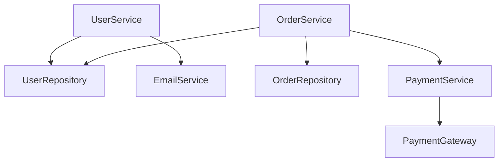

# Architecture Analyzer Examples

Analyze project architecture, detect issues, and generate dependency graphs.

## Example 1: Detect Circular Dependencies

```
Analyze src/ directory for circular dependencies
```

### Expected Output:

```
🔍 Architecture Analysis

Circular Dependencies Found: 2

1. Circular dependency chain:
   src/user/service.ts
   → src/order/service.ts
   → src/payment/service.ts
   → src/user/service.ts

   Impact: High - Creates tight coupling
   Recommendation: Extract shared logic to a separate module

2. Circular dependency chain:
   src/auth/index.ts
   → src/middleware/auth.ts
   → src/auth/index.ts

   Impact: Medium
   Recommendation: Move middleware to separate directory
```

## Example 2: Layer Violations

```
Check for architecture layer violations in src/ with layers: [presentation, business, data]
```

### Output:

```
❌ Layer Violations Found: 3

1. Line 45 in src/presentation/UserController.ts
   Direct database access from presentation layer

   src/presentation/UserController.ts
   → src/data/UserRepository.ts

   Fix: Access data layer through business layer

2. Line 112 in src/data/OrderRepository.ts
   Data layer calling presentation layer

   Recommendation: Invert dependency using interfaces
```

## Example 3: Generate Dependency Graph

```
Generate dependency graph for src/ in Mermaid format
```

### Output:



## Example 4: Detect Code Smells

```
Analyze src/ for architectural code smells
```

### Output:

```
📊 Code Smell Report

God Classes (2):
- src/UserService.ts (1250 lines, 45 methods)
  Recommendation: Split into UserService, UserValidator, UserNotifier

Hub Dependencies (1):
- src/utils/index.ts (imported by 87 files)
  Risk: Changes here affect entire codebase

Cyclomatic Complexity (3 functions > 15):
- processOrder() - complexity: 23
- validateUser() - complexity: 18
```

## MCP Tool Reference

```json
{
  "tool": "analyze_architecture",
  "arguments": {
    "path": "src/",
    "checks": ["circular", "layers", "complexity"]
  }
}
```
