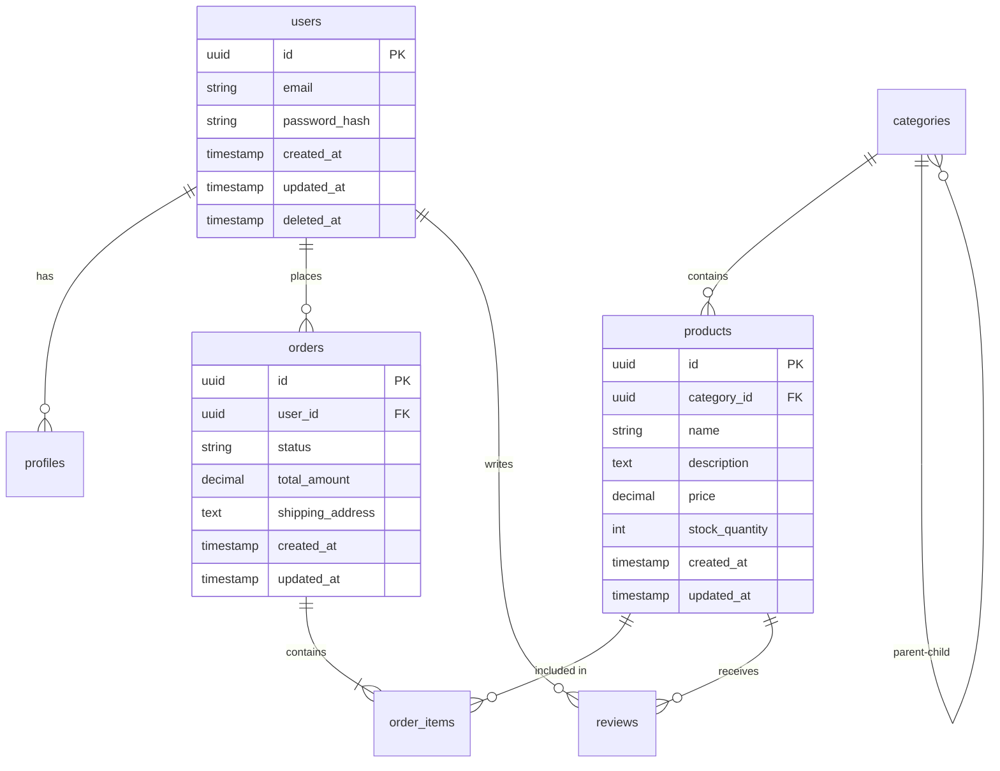

# Database Schema Designer Examples

This example shows how to design database schemas from plain text requirements.

## Example 1: E-commerce Database Schema

**Requirements File**: `ecommerce-requirements.txt`

### Using with Claude Code

```
Design a PostgreSQL database schema based on examples/db-schema/ecommerce-requirements.txt with timestamps and soft deletes
```

### Expected Output

**SQL Schema**:
```sql
-- Users table
CREATE TABLE users (
  id UUID PRIMARY KEY DEFAULT gen_random_uuid(),
  email VARCHAR(255) UNIQUE NOT NULL,
  password_hash VARCHAR(255) NOT NULL,
  created_at TIMESTAMP DEFAULT CURRENT_TIMESTAMP,
  updated_at TIMESTAMP DEFAULT CURRENT_TIMESTAMP,
  deleted_at TIMESTAMP
);

-- User profiles
CREATE TABLE profiles (
  id UUID PRIMARY KEY DEFAULT gen_random_uuid(),
  user_id UUID REFERENCES users(id) ON DELETE CASCADE,
  name VARCHAR(255) NOT NULL,
  phone VARCHAR(50),
  address TEXT,
  created_at TIMESTAMP DEFAULT CURRENT_TIMESTAMP,
  updated_at TIMESTAMP DEFAULT CURRENT_TIMESTAMP
);

-- Categories
CREATE TABLE categories (
  id UUID PRIMARY KEY DEFAULT gen_random_uuid(),
  name VARCHAR(255) NOT NULL,
  description TEXT,
  parent_id UUID REFERENCES categories(id),
  created_at TIMESTAMP DEFAULT CURRENT_TIMESTAMP,
  updated_at TIMESTAMP DEFAULT CURRENT_TIMESTAMP
);

-- Products
CREATE TABLE products (
  id UUID PRIMARY KEY DEFAULT gen_random_uuid(),
  category_id UUID REFERENCES categories(id),
  name VARCHAR(255) NOT NULL,
  description TEXT,
  price DECIMAL(10,2) NOT NULL,
  stock_quantity INTEGER DEFAULT 0,
  created_at TIMESTAMP DEFAULT CURRENT_TIMESTAMP,
  updated_at TIMESTAMP DEFAULT CURRENT_TIMESTAMP,
  deleted_at TIMESTAMP
);

-- Orders
CREATE TABLE orders (
  id UUID PRIMARY KEY DEFAULT gen_random_uuid(),
  user_id UUID REFERENCES users(id),
  status VARCHAR(50) NOT NULL DEFAULT 'pending',
  total_amount DECIMAL(10,2) NOT NULL,
  shipping_address TEXT NOT NULL,
  created_at TIMESTAMP DEFAULT CURRENT_TIMESTAMP,
  updated_at TIMESTAMP DEFAULT CURRENT_TIMESTAMP
);

-- Order items
CREATE TABLE order_items (
  id UUID PRIMARY KEY DEFAULT gen_random_uuid(),
  order_id UUID REFERENCES orders(id) ON DELETE CASCADE,
  product_id UUID REFERENCES products(id),
  quantity INTEGER NOT NULL,
  price DECIMAL(10,2) NOT NULL,
  created_at TIMESTAMP DEFAULT CURRENT_TIMESTAMP
);

-- Product reviews
CREATE TABLE reviews (
  id UUID PRIMARY KEY DEFAULT gen_random_uuid(),
  product_id UUID REFERENCES products(id) ON DELETE CASCADE,
  user_id UUID REFERENCES users(id),
  rating INTEGER CHECK (rating >= 1 AND rating <= 5),
  comment TEXT,
  created_at TIMESTAMP DEFAULT CURRENT_TIMESTAMP,
  updated_at TIMESTAMP DEFAULT CURRENT_TIMESTAMP
);

-- Indexes for performance
CREATE INDEX idx_products_category ON products(category_id);
CREATE INDEX idx_orders_user ON orders(user_id);
CREATE INDEX idx_orders_status ON orders(status);
CREATE INDEX idx_order_items_order ON order_items(order_id);
CREATE INDEX idx_reviews_product ON reviews(product_id);
```

## Example 2: Generate ER Diagram

```
Create a Mermaid ER diagram for the e-commerce database schema
```

### Expected Output



## Example 3: Generate Migration Files

```
Generate a migration for the e-commerce schema with up/down scripts
```

### Expected Output

**Migration: 001_create_ecommerce_schema.sql**
```sql
-- Up
CREATE TABLE users (
  -- ... schema ...
);
-- ... more tables ...

-- Down
DROP TABLE IF EXISTS reviews;
DROP TABLE IF EXISTS order_items;
DROP TABLE IF EXISTS orders;
DROP TABLE IF EXISTS products;
DROP TABLE IF EXISTS categories;
DROP TABLE IF EXISTS profiles;
DROP TABLE IF EXISTS users;
```

## Example 4: MongoDB Schema

```
Design a MongoDB schema for the e-commerce platform with embedded documents
```

### Expected Output

```javascript
// users collection
{
  _id: ObjectId,
  email: String,
  passwordHash: String,
  profile: {
    name: String,
    phone: String,
    address: String
  },
  createdAt: Date,
  updatedAt: Date
}

// products collection
{
  _id: ObjectId,
  categoryId: ObjectId,
  name: String,
  description: String,
  price: Number,
  stockQuantity: Number,
  reviews: [
    {
      userId: ObjectId,
      rating: Number,
      comment: String,
      createdAt: Date
    }
  ],
  createdAt: Date,
  updatedAt: Date
}

// orders collection
{
  _id: ObjectId,
  userId: ObjectId,
  status: String,
  totalAmount: Number,
  shippingAddress: String,
  items: [
    {
      productId: ObjectId,
      quantity: Number,
      price: Number
    }
  ],
  createdAt: Date,
  updatedAt: Date
}
```

## Example 5: Schema Optimization

```
Analyze the e-commerce schema and suggest index optimizations
```

### Expected Suggestions

```
📊 Index Optimization Recommendations:

1. Add composite index on orders(user_id, status) for user order history queries
2. Add index on products(price) for price range filtering
3. Add full-text index on products(name, description) for search
4. Add index on reviews(product_id, rating) for product ratings
5. Consider partitioning orders table by created_at for scalability
```

## MCP Tool Reference

### Design Schema
```json
{
  "tool": "design_schema",
  "arguments": {
    "requirements": "Users have many orders. Orders contain products...",
    "options": {
      "database": "postgres",
      "includeTimestamps": true,
      "includeSoftDeletes": true,
      "useUUIDs": true,
      "normalForm": "3NF"
    }
  }
}
```

### Generate Migration
```json
{
  "tool": "generate_migration",
  "arguments": {
    "schema": { /* schema object */ },
    "description": "create initial schema"
  }
}
```

### Create ER Diagram
```json
{
  "tool": "create_er_diagram",
  "arguments": {
    "schema": { /* schema object */ },
    "options": {
      "format": "mermaid",
      "includeColumns": true,
      "includeRelationships": true
    }
  }
}
```

## Tips

- **Normal Forms**: Tool automatically suggests 3NF normalization
- **Indexing**: Recommends indexes based on foreign keys and common query patterns
- **Constraints**: Adds appropriate CHECK, UNIQUE, and NOT NULL constraints
- **Soft Deletes**: Optional deleted_at column for logical deletion
- **Timestamps**: Automatic created_at/updated_at tracking
