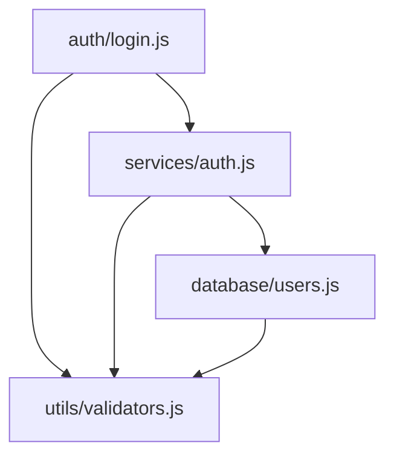

# @j0kz/architecture-analyzer-mcp

**Detect circular dependencies, layer violations, and generate dependency graphs for cleaner architecture.**

[](https://www.npmjs.com/package/@j0kz/architecture-analyzer-mcp)
[](LICENSE)
[](https://modelcontextprotocol.io/)

Part of the [@j0kz MCP Agents](https://github.com/j0kz/mcp-agents) collection.

---

## ✨ Features

- 🔍 **Circular Dependency Detection** - Find and fix dependency cycles
- 📐 **Layer Violation Analysis** - Enforce architectural boundaries
- 📊 **Dependency Graphs** - Visualize module relationships (Mermaid format)
- 🎯 **Refactoring Suggestions** - Get actionable improvement recommendations
- ⚡ **Fast Scanning** - Analyze large codebases quickly
- 🎨 **Multi-Language Support** - JavaScript, TypeScript, Python, and more

---

## 🚀 Quick Start

### Claude Code

```bash
# Install globally (recommended)
claude mcp add architecture-analyzer "npx @j0kz/architecture-analyzer-mcp" --scope user

# Verify installation
claude mcp list
```

### Cursor

Add to `~/.cursor/mcp_config.json`:

```json
{
  "mcpServers": {
    "architecture-analyzer": {
      "command": "npx",
      "args": ["@j0kz/architecture-analyzer-mcp"]
    }
  }
}
```

### Windsurf

Add to Windsurf settings:

```json
{
  "mcp": {
    "servers": {
      "architecture-analyzer": {
        "command": "npx @j0kz/architecture-analyzer-mcp"
      }
    }
  }
}
```

### Roo Code / Continue / Other MCP Editors

See [full compatibility guide](https://github.com/j0kz/mcp-agents/blob/main/EDITOR_COMPATIBILITY.md).

---

## 🎯 Usage

Once installed, use through your AI editor's chat:

### Analyze Architecture
```
"Analyze the project architecture"
"Check for circular dependencies"
"Find layer violations in src/"
```

### Generate Visualizations
```
"Generate a dependency graph for the auth module"
"Create architecture diagram"
"Show module relationships"
```

### Get Refactoring Advice
```
"Suggest architecture improvements"
"How can I fix circular dependencies?"
"What layers should I separate?"
```

---

## 🛠️ Available MCP Tools

### `mcp__architecture-analyzer__analyze_architecture`

Comprehensive architecture analysis of your project.

**Parameters:**
- `projectPath` (required): Path to project root
- `config` (optional): Analysis configuration
  - `detectCircular`: boolean (default: true)
  - `generateGraph`: boolean (default: true)
  - `maxDepth`: number (default: 5)
  - `excludePatterns`: string[] (default: ["node_modules", "dist"])
  - `layerRules`: object - Layer dependency rules

**Example:**
```typescript
{
  "projectPath": "./src",
  "config": {
    "detectCircular": true,
    "generateGraph": true,
    "maxDepth": 3,
    "layerRules": {
      "presentation": ["business"],
      "business": ["data"],
      "data": []
    }
  }
}
```

### `mcp__architecture-analyzer__get_module_info`

Get detailed information about a specific module.

**Parameters:**
- `projectPath` (required): Path to project root
- `modulePath` (required): Relative path to module

**Example:**
```typescript
{
  "projectPath": "./src",
  "modulePath": "auth/login.js"
}
```

### `mcp__architecture-analyzer__find_circular_deps`

Find all circular dependencies in the project.

**Parameters:**
- `projectPath` (required): Path to project root

**Example:**
```typescript
{
  "projectPath": "./src"
}
```

---

## ⚙️ Configuration

### Layer Rules

Define architectural layers and allowed dependencies:

```json
{
  "layerRules": {
    "presentation": ["business", "common"],
    "business": ["data", "common"],
    "data": ["common"],
    "common": []
  }
}
```

This enforces:
- Presentation layer can depend on Business and Common
- Business layer can depend on Data and Common
- Data layer can only depend on Common
- Common layer has no dependencies

### Exclusion Patterns

Exclude directories from analysis:

```json
{
  "excludePatterns": [
    "node_modules",
    "dist",
    "build",
    "**/*.test.js",
    "**/*.spec.ts"
  ]
}
```

### Custom Configuration

Create `.architecture-analyzer.json` in your project root:

```json
{
  "detectCircular": true,
  "generateGraph": true,
  "maxDepth": 5,
  "excludePatterns": [
    "node_modules/**",
    "dist/**",
    "**/*.test.js"
  ],
  "layerRules": {
    "controllers": ["services", "utils"],
    "services": ["repositories", "utils"],
    "repositories": ["models", "utils"],
    "models": ["utils"],
    "utils": []
  },
  "visualization": {
    "format": "mermaid",
    "direction": "TB",
    "theme": "default"
  }
}
```

---

## 📊 What Gets Analyzed

### Circular Dependencies
```
Module A → Module B → Module C → Module A
```
Detects cycles of any length and suggests fixes.

### Layer Violations
```
Data Layer → Presentation Layer (VIOLATION!)
```
Ensures lower layers don't depend on higher layers.

### Module Complexity
- Number of dependencies
- Number of dependents
- Coupling metrics
- Cohesion scores

### Dependency Graphs

Generates Mermaid diagrams:



---

## 🎯 Analysis Results

### Circular Dependencies Report
```
  src/auth/login.js
  → src/services/auth.js
  → src/auth/session.js
  → src/auth/login.js

💡 Suggestion: Extract shared code to auth/common.js
```

### Layer Violations Report
```
  data/repository.js imports from presentation/controller.js

💡 Suggestion: Move shared logic to business layer
```

### Module Metrics
```
📊 Module Analysis: src/services/auth.js
  - Dependencies: 5
  - Dependents: 12
  - Coupling: Medium
  - Complexity: High

💡 Suggestion: Consider splitting into smaller modules
```

---

## 🏗️ Common Architecture Patterns

### Clean Architecture (Layered)
```
presentation/
  ├─ controllers/
  └─ views/
business/
  ├─ services/
  └─ usecases/
data/
  ├─ repositories/
  └─ models/
common/
  └─ utils/
```

### Feature-Based
```
features/
  ├─ auth/
  ├─ users/
  └─ products/
shared/
  └─ utils/
```

### Domain-Driven Design
```
domain/
  ├─ entities/
  └─ valueObjects/
application/
  └─ usecases/
infrastructure/
  ├─ persistence/
  └─ api/
```

---

## 🔧 Troubleshooting

### No Issues Detected

- Verify `projectPath` is correct
- Check `excludePatterns` aren't too broad
- Ensure files have imports/requires

### Graph Not Generating

```json
{
  "generateGraph": true
}
```

Ensure this is set in config.

### Performance Issues

- Reduce `maxDepth` to 3 or 4
- Add more `excludePatterns`
- Analyze specific subdirectories instead of entire project

---


## 📦 Complete @j0kz MCP Development Toolkit

This package is part of a comprehensive suite of 8 MCP agents for professional development:

### 🎯 Code Quality Suite
- **[@j0kz/smart-reviewer-mcp](https://www.npmjs.com/package/@j0kz/smart-reviewer-mcp)** - AI-powered code review and quality analysis
- **[@j0kz/test-generator-mcp](https://www.npmjs.com/package/@j0kz/test-generator-mcp)** - Automated test generation with edge cases
- **[@j0kz/refactor-assistant-mcp](https://www.npmjs.com/package/@j0kz/refactor-assistant-mcp)** - Intelligent code refactoring tools

### 🏗️ Architecture & Design
- **[@j0kz/architecture-analyzer-mcp](https://www.npmjs.com/package/@j0kz/architecture-analyzer-mcp)** - Architecture analysis and dependency graphs
- **[@j0kz/api-designer-mcp](https://www.npmjs.com/package/@j0kz/api-designer-mcp)** - REST/GraphQL API design and OpenAPI generation
- **[@j0kz/db-schema-mcp](https://www.npmjs.com/package/@j0kz/db-schema-mcp)** - Database schema design and migrations

### 📚 Documentation & Security
- **[@j0kz/doc-generator-mcp](https://www.npmjs.com/package/@j0kz/doc-generator-mcp)** - Automated JSDoc, README, and API documentation
- **[@j0kz/security-scanner-mcp](https://www.npmjs.com/package/@j0kz/security-scanner-mcp)** - Security vulnerability scanning and OWASP checks

### Install Complete Suite

```bash
# Claude Code - Install all 8 MCPs
claude mcp add smart-reviewer "npx @j0kz/smart-reviewer-mcp" --scope user
claude mcp add test-generator "npx @j0kz/test-generator-mcp" --scope user
claude mcp add architecture-analyzer "npx @j0kz/architecture-analyzer-mcp" --scope user
claude mcp add doc-generator "npx @j0kz/doc-generator-mcp" --scope user
claude mcp add security-scanner "npx @j0kz/security-scanner-mcp" --scope user
claude mcp add refactor-assistant "npx @j0kz/refactor-assistant-mcp" --scope user
claude mcp add api-designer "npx @j0kz/api-designer-mcp" --scope user
claude mcp add db-schema "npx @j0kz/db-schema-mcp" --scope user

# Verify all installed
claude mcp list
```

### Other Editors

**Cursor/Windsurf/Roo Code**: See [Editor Compatibility Guide](https://github.com/j0kz/mcp-agents/blob/main/EDITOR_COMPATIBILITY.md)

## 📦 Complete @j0kz MCP Development Toolkit

This package is part of a comprehensive suite of 8 MCP agents for professional development:

### 🎯 Code Quality Suite
- **[@j0kz/smart-reviewer-mcp](https://www.npmjs.com/package/@j0kz/smart-reviewer-mcp)** - AI-powered code review and quality analysis
- **[@j0kz/test-generator-mcp](https://www.npmjs.com/package/@j0kz/test-generator-mcp)** - Automated test generation with edge cases
- **[@j0kz/refactor-assistant-mcp](https://www.npmjs.com/package/@j0kz/refactor-assistant-mcp)** - Intelligent code refactoring tools

### 🏗️ Architecture & Design
- **[@j0kz/architecture-analyzer-mcp](https://www.npmjs.com/package/@j0kz/architecture-analyzer-mcp)** - Architecture analysis and dependency graphs
- **[@j0kz/api-designer-mcp](https://www.npmjs.com/package/@j0kz/api-designer-mcp)** - REST/GraphQL API design and OpenAPI generation
- **[@j0kz/db-schema-mcp](https://www.npmjs.com/package/@j0kz/db-schema-mcp)** - Database schema design and migrations

### 📚 Documentation & Security
- **[@j0kz/doc-generator-mcp](https://www.npmjs.com/package/@j0kz/doc-generator-mcp)** - Automated JSDoc, README, and API documentation
- **[@j0kz/security-scanner-mcp](https://www.npmjs.com/package/@j0kz/security-scanner-mcp)** - Security vulnerability scanning and OWASP checks

### Install Complete Suite

```bash
# Claude Code - Install all 8 MCPs
claude mcp add smart-reviewer "npx @j0kz/smart-reviewer-mcp" --scope user
claude mcp add test-generator "npx @j0kz/test-generator-mcp" --scope user
claude mcp add architecture-analyzer "npx @j0kz/architecture-analyzer-mcp" --scope user
claude mcp add doc-generator "npx @j0kz/doc-generator-mcp" --scope user
claude mcp add security-scanner "npx @j0kz/security-scanner-mcp" --scope user
claude mcp add refactor-assistant "npx @j0kz/refactor-assistant-mcp" --scope user
claude mcp add api-designer "npx @j0kz/api-designer-mcp" --scope user
claude mcp add db-schema "npx @j0kz/db-schema-mcp" --scope user

# Verify all installed
claude mcp list
```

### Other Editors

**Cursor/Windsurf/Roo Code**: See [Editor Compatibility Guide](https://github.com/j0kz/mcp-agents/blob/main/EDITOR_COMPATIBILITY.md)


---

## 🤝 Contributing

Contributions welcome! Please visit the [main repository](https://github.com/j0kz/mcp-agents).

---

## 📝 License

MIT © [j0kz](https://www.npmjs.com/~j0kz)

---

## 🔗 Links

- **NPM Package**: https://www.npmjs.com/package/@j0kz/architecture-analyzer-mcp
- **GitHub**: https://github.com/j0kz/mcp-agents
- **Issues**: https://github.com/j0kz/mcp-agents/issues
- **All Packages**: https://www.npmjs.com/~j0kz
- **MCP Specification**: https://modelcontextprotocol.io/
