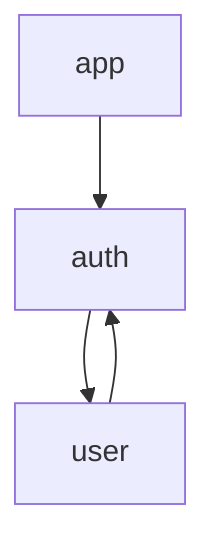

# Architecture Analyzer Agent

Architecture analysis and visualization agent that detects circular dependencies, layer violations, and generates dependency graphs.

## Features

- 🏗️ **Architecture Analysis**: Comprehensive project structure analysis
- 🔄 **Circular Dependency Detection**: Identifies and reports dependency cycles
- 📊 **Metrics Calculation**: Cohesion, coupling, and complexity metrics
- 🗺️ **Dependency Graph**: Generates Mermaid diagrams
- 🛡️ **Layer Validation**: Enforces architectural boundaries
- 💡 **Refactoring Suggestions**: Actionable improvement recommendations

## Tools Available

### `analyze_architecture`

Analyze complete project architecture.

**Parameters:**

- `projectPath` (string, required): Path to project root
- `config` (object, optional): Analysis configuration
  - `maxDepth`: number (directory traversal depth)
  - `excludePatterns`: string[] (patterns to exclude)
  - `detectCircular`: boolean (detect circular dependencies)
  - `generateGraph`: boolean (generate Mermaid diagram)
  - `layerRules`: object (layer dependency rules)

**Example:**

```bash
claude code "Analyze project architecture with architecture-analyzer"
```

**Response includes:**

- Module inventory
- Dependency relationships
- Circular dependencies
- Layer violations
- Architecture metrics
- Improvement suggestions
- Dependency graph (Mermaid format)

### `get_module_info`

Get detailed information about a specific module.

**Parameters:**

- `projectPath` (string, required): Path to project root
- `modulePath` (string, required): Relative path to module

**Example:**

```bash
claude code "Get info for src/api/auth.js with architecture-analyzer"
```

### `find_circular_deps`

Find all circular dependencies in the project.

**Parameters:**

- `projectPath` (string, required): Path to project root

**Example:**

```bash
claude code "Find circular dependencies with architecture-analyzer"
```

## Architecture Metrics

### Cohesion (0-100)

Measures how related modules are within the project.

- **High (70-100)**: Well-organized, focused modules
- **Medium (40-70)**: Acceptable organization
- **Low (0-40)**: Scattered, unfocused modules

### Coupling (0-100)

Measures interdependence between modules.

- **Low (0-30)**: Loosely coupled, easy to modify
- **Medium (30-60)**: Moderate coupling
- **High (60-100)**: Tightly coupled, hard to change

### Other Metrics

- **Total Modules**: Number of source files
- **Total Dependencies**: Number of import relationships
- **Average Dependencies**: Dependencies per module
- **Max Dependencies**: Highest dependency count
- **Circular Dependencies**: Number of dependency cycles
- **Layer Violations**: Architectural boundary breaches

## Circular Dependencies

### What Are They?

A circular dependency occurs when Module A depends on Module B, which depends on Module A (directly or indirectly).

### Why Are They Bad?

- Make code harder to understand
- Complicate testing and mocking
- Can cause initialization issues
- Increase coupling

### Example Detection

```json
{
  "circularDependencies": [
    {
      "cycle": [
        "src/services/user.js",
        "src/services/auth.js",
        "src/services/session.js",
        "src/services/user.js"
      ],
      "severity": "error"
    }
  ]
}
```

### How to Fix

1. **Extract Interface**: Create a common interface/module
2. **Dependency Injection**: Pass dependencies as parameters
3. **Event System**: Use pub/sub to decouple
4. **Restructure**: Move shared code to new module

## Layer Validation

Define architectural layers and enforce dependencies:

```json
{
  "layerRules": {
    "presentation": ["business", "common"],
    "business": ["data", "common"],
    "data": ["common"],
    "common": []
  }
}
```

This ensures:

- Presentation layer can only use Business and Common
- Business layer can only use Data and Common
- Data layer can only use Common
- Common layer has no dependencies

### Violation Example

```json
{
  "layerViolations": [
    {
      "from": "src/data/repository.js",
      "to": "src/presentation/views/UserView.js",
      "expectedLayer": "common",
      "actualLayer": "presentation",
      "description": "data should not depend on presentation"
    }
  ]
}
```

## Dependency Graph

Generates Mermaid diagram for visualization:



## Example Output

```json
{
  "projectPath": "/path/to/project",
  "modules": [
    {
      "name": "src/app",
      "path": "src/app.js",
      "imports": ["./services/auth", "./utils/logger"],
      "exports": ["default", "App"],
      "linesOfCode": 150,
      "dependencies": ["./services/auth", "./utils/logger"]
    }
  ],
  "dependencies": [
    {
      "from": "src/app.js",
      "to": "src/services/auth.js",
      "type": "import"
    }
  ],
  "circularDependencies": [],
  "layerViolations": [],
  "metrics": {
    "totalModules": 45,
    "totalDependencies": 128,
    "averageDependenciesPerModule": 3,
    "maxDependencies": 12,
    "circularDependencies": 0,
    "layerViolations": 0,
    "cohesion": 75,
    "coupling": 45
  },
  "suggestions": [
    "Architecture is well-organized with good cohesion.",
    "Coupling is moderate. Consider reducing dependencies in high-coupling modules."
  ],
  "dependencyGraph": "graph TD\n  ...",
  "timestamp": "2025-09-30T12:00:00.000Z"
}
```

## Integration with Claude Code

### Architecture Review

```bash
# Initial architecture analysis
claude code "Analyze the architecture and identify issues"

# Focus on specific concerns
claude code "Check for circular dependencies in the project"

# Module-specific analysis
claude code "Analyze dependencies for src/services/api.js"
```

### Refactoring Guidance

```bash
# Before major refactor
claude code "Analyze architecture and suggest refactoring opportunities"

# After refactoring
claude code "Verify architecture improvements after refactor"
```

### CI/CD Integration

```bash
# In GitHub Actions or CI pipeline
- name: Architecture Check
  run: |
    claude code "Analyze architecture and fail if circular deps > 0"
```

## Configuration

Create `~/.config/claude-code/agents.config.json`:

```json
{
  "architecture-analyzer": {
    "maxDepth": 5,
    "excludePatterns": ["node_modules", "dist", "tests", "*.test.js"],
    "layerRules": {
      "controllers": ["services", "utils"],
      "services": ["repositories", "utils"],
      "repositories": ["utils"],
      "utils": []
    }
  }
}
```

## Best Practices

1. **Regular Analysis**: Run weekly or before major releases
2. **Define Layers**: Establish clear architectural boundaries
3. **Monitor Metrics**: Track cohesion/coupling over time
4. **Fix Circular Deps**: Address immediately when detected
5. **Document Architecture**: Use generated graphs in docs
6. **Enforce in CI**: Fail builds on architecture violations

## Common Patterns Detected

### 🚫 Anti-patterns

- **God Module**: Single module with too many dependencies
- **Circular Dependencies**: Mutual dependencies
- **Layer Jumping**: Skipping architectural layers
- **Scattered Functionality**: Low cohesion

### ✅ Good Patterns

- **Clear Layers**: Defined architectural boundaries
- **High Cohesion**: Related code grouped together
- **Low Coupling**: Minimal cross-module dependencies
- **Dependency Injection**: Inverted dependencies

## Roadmap

- [ ] Support for monorepos and workspaces
- [ ] Architectural pattern detection (MVC, Clean, Hexagonal)
- [ ] Historical trend analysis
- [ ] Automatic refactoring suggestions with code generation
- [ ] Integration with architecture documentation tools
- [ ] Real-time architecture monitoring
- [ ] Team collaboration features
- [ ] Export to C4 diagrams
