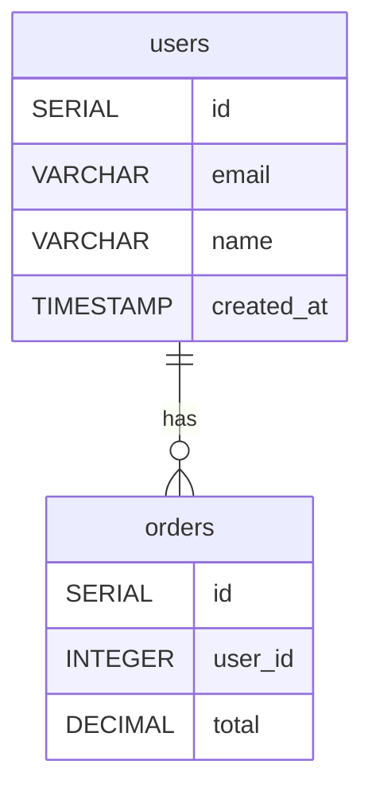

# Database Schema Designer MCP

A powerful Model Context Protocol (MCP) server for designing, migrating, and optimizing database schemas. Supports **PostgreSQL**, **MySQL**, and **MongoDB** with intelligent schema design, automatic migration generation, ER diagram creation, and optimization suggestions.

## Features

- **Multi-Database Support**: PostgreSQL, MySQL, MongoDB
- **Intelligent Schema Design**: Convert plain text requirements to complete schemas
- **Migration Generation**: Automatic up/down migrations
- **ER Diagrams**: Mermaid, PlantUML, and DBML formats
- **Index Optimization**: Smart index suggestions based on queries
- **Schema Normalization**: Detect and fix normal form violations
- **Seed Data Generation**: Realistic test data generation
- **Schema Validation**: Comprehensive error and best practice checks
- **Production-Ready**: Full TypeScript types, error handling, JSDoc comments

## Installation

```bash
npm install @j0kz/db-schema-mcp
```

Or use directly with npx:

```bash
npx @j0kz/db-schema-mcp
```

## Quick Start

### 1. Add to Claude Desktop

Add to your `claude_desktop_config.json`:

```json
{
  "mcpServers": {
    "db-schema": {
      "command": "npx",
      "args": ["-y", "@j0kz/db-schema-mcp"]
    }
  }
}
```

### 2. Use in Your Editor

**Claude Code / Cursor / Windsurf / Roo Code:**

The MCP server automatically registers 8 powerful tools for database schema design.

## Available Tools

### 1. `design_schema`

Design a complete database schema from plain text requirements.

**Input:**
```json
{
  "requirements": "We need users who can create orders. Each order contains multiple products. Products belong to categories. Users have addresses.",
  "options": {
    "database": "postgres",
    "normalForm": "3NF",
    "includeTimestamps": true,
    "includeSoftDeletes": false,
    "useUUIDs": false,
    "addIndexes": true
  }
}
```

**Output:**
Complete schema with tables, columns, relationships, indexes, and constraints.

### 2. `generate_migration`

Generate database migration files (up/down).

**Input:**
```json
{
  "schema": { /* schema object */ },
  "description": "create initial user and order tables"
}
```

**Output:**
```sql
-- Migration V20250101120000
CREATE TABLE users (
  id SERIAL PRIMARY KEY,
  email VARCHAR(255) UNIQUE NOT NULL,
  name VARCHAR(255) NOT NULL,
  created_at TIMESTAMP DEFAULT CURRENT_TIMESTAMP NOT NULL
);

CREATE INDEX idx_users_created_at ON users(created_at);
```

### 3. `create_er_diagram`

Create Entity-Relationship diagrams in multiple formats.

**Input:**
```json
{
  "schema": { /* schema object */ },
  "options": {
    "format": "mermaid",
    "includeColumns": true,
    "includeRelationships": true
  }
}
```

**Output:**


### 4. `optimize_indexes`

Suggest index optimizations based on schema analysis.

**Input:**
```json
{
  "schema": { /* schema object */ }
}
```

**Output:**
```json
[
  {
    "table": "orders",
    "columns": ["user_id"],
    "type": "BTREE",
    "reason": "Foreign key column 'user_id' should be indexed to improve JOIN performance",
    "estimatedImpact": "HIGH",
    "priority": 1
  },
  {
    "table": "orders",
    "columns": ["status", "created_at"],
    "type": "BTREE",
    "reason": "Compound index on status and timestamp for efficient filtering and sorting",
    "estimatedImpact": "HIGH",
    "priority": 1
  }
]
```

### 5. `normalize_schema`

Suggest normalizations to improve data integrity.

**Input:**
```json
{
  "schema": { /* schema object */ }
}
```

**Output:**
```json
[
  {
    "type": "EXTRACT_TABLE",
    "description": "Table 'users' has potential transitive dependencies in address columns",
    "affectedTables": ["users"],
    "proposedChanges": "Extract address fields into a separate 'addresses' table",
    "normalForm": "3NF"
  }
]
```

### 6. `generate_seed_data`

Generate realistic seed data for testing.

**Input:**
```json
{
  "schema": { /* schema object */ },
  "recordsPerTable": 10
}
```

**Output:**
```json
[
  {
    "table": "users",
    "records": [
      { "email": "user0@example.com", "name": "Test name 0" },
      { "email": "user1@example.com", "name": "Test name 1" }
    ],
    "truncateFirst": true
  }
]
```

### 7. `validate_schema`

Validate schema for errors and best practices.

**Input:**
```json
{
  "schema": { /* schema object */ }
}
```

**Output:**
```json
{
  "valid": false,
  "errors": [
    {
      "type": "MISSING_PRIMARY_KEY",
      "table": "orders",
      "message": "Table 'orders' does not have a primary key",
      "severity": "ERROR"
    }
  ],
  "warnings": [
    {
      "type": "MISSING_TIMESTAMP",
      "table": "products",
      "message": "Table 'products' does not have timestamp columns",
      "suggestion": "Add created_at and updated_at columns for audit trail"
    }
  ]
}
```

### 8. `analyze_schema`

Analyze schema complexity and characteristics.

**Input:**
```json
{
  "schema": { /* schema object */ }
}
```

**Output:**
```json
{
  "tableCount": 5,
  "columnCount": 42,
  "indexCount": 12,
  "relationshipCount": 6,
  "normalForm": "3NF",
  "estimatedSize": {
    "rows": 5000,
    "storage": "3MB"
  },
  "complexity": "MEDIUM"
}
```

## Real-World Examples

### E-Commerce Platform (PostgreSQL)

```typescript
// Design schema
const schema = await mcp.design_schema({
  requirements: `
    E-commerce platform with:
    - Users with authentication and profiles
    - Products organized in categories
    - Shopping cart functionality
    - Order processing with line items
    - Payment tracking
    - Product reviews and ratings
    - Shipping addresses
  `,
  options: {
    database: 'postgres',
    normalForm: '3NF',
    includeTimestamps: true,
    includeSoftDeletes: true,
    useUUIDs: true,
    addIndexes: true
  }
});

// Generate migration
const migration = await mcp.generate_migration({
  schema,
  description: 'create e-commerce schema'
});

// Get optimization suggestions
const indexSuggestions = await mcp.optimize_indexes({ schema });

// Create ER diagram
const diagram = await mcp.create_er_diagram({
  schema,
  options: { format: 'mermaid', includeColumns: true }
});
```

### Blog Platform (MySQL)

```typescript
const schema = await mcp.design_schema({
  requirements: `
    Blog platform with:
    - Authors can write posts
    - Posts have categories and tags
    - Comments on posts with threading
    - User authentication
    - Post drafts and publishing
  `,
  options: {
    database: 'mysql',
    normalForm: '3NF',
    includeTimestamps: true,
    addIndexes: true
  }
});

// Validate schema
const validation = await mcp.validate_schema({ schema });

// Generate seed data
const seedData = await mcp.generate_seed_data({
  schema,
  recordsPerTable: 50
});
```

### Social Media App (MongoDB)

```typescript
const schema = await mcp.design_schema({
  requirements: `
    Social media app with:
    - User profiles with followers
    - Posts with likes and comments
    - Direct messaging between users
    - Media uploads (photos/videos)
    - Hashtags and mentions
    - Activity feed
  `,
  options: {
    database: 'mongodb',
    includeTimestamps: true,
    addIndexes: true
  }
});

// Get normalization suggestions
const normalizations = await mcp.normalize_schema({ schema });

// Analyze complexity
const analysis = await mcp.analyze_schema({ schema });
```

## Database Support

### PostgreSQL Features
- SERIAL/BIGSERIAL auto-increment
- UUID support with gen_random_uuid()
- JSONB with GIN indexes
- Full-text search (TSVECTOR)
- Array types
- ENUM types
- Timestamp with timezone (TIMESTAMPTZ)
- Advanced constraints (CHECK, EXCLUDE)

### MySQL Features
- AUTO_INCREMENT
- JSON columns
- Full-text indexes
- ENUM types
- Spatial types (POINT, GEOMETRY)
- Partitioning support
- InnoDB foreign keys

### MongoDB Features
- ObjectId references
- Embedded documents
- Array fields
- Schema validation
- Compound indexes
- Text search indexes
- Time-series collections
- Capped collections

## Schema Design Options

```typescript
interface SchemaDesignOptions {
  database: 'postgres' | 'mysql' | 'mongodb';
  normalForm?: '1NF' | '2NF' | '3NF' | 'BCNF';  // Default: 3NF
  includeTimestamps?: boolean;                    // Default: true
  includeSoftDeletes?: boolean;                   // Default: false
  useUUIDs?: boolean;                            // Default: false (SQL only)
  addIndexes?: boolean;                          // Default: true
  addComments?: boolean;                         // Default: true
}
```

## Best Practices

### 1. Schema Design
- Use 3NF for transactional systems
- Denormalize carefully for read-heavy workloads
- Always include timestamps for audit trails
- Use UUIDs for distributed systems
- Add soft deletes for data recovery

### 2. Indexing
- Index foreign keys
- Create compound indexes for common query patterns
- Use partial indexes for filtered queries (PostgreSQL)
- Avoid over-indexing (impacts write performance)
- Use GIN indexes for JSONB and full-text search

### 3. Migrations
- Always create reversible migrations
- Test migrations on staging first
- Include data migrations when needed
- Version control all migrations
- Document breaking changes

### 4. Validation
- Run validation before deployment
- Fix all ERROR-level issues
- Address WARNING-level issues for production
- Regular schema audits
- Monitor index usage

## Advanced Usage

### Custom Schema Design

```typescript
import {
  DatabaseSchema,
  SQLTable,
  SQLColumn,
  ForeignKey,
  Index
} from '@j0kz/db-schema-mcp';

const customSchema: DatabaseSchema = {
  database: 'postgres',
  name: 'custom_app',
  version: '1.0.0',
  tables: [
    {
      name: 'users',
      columns: [
        { name: 'id', type: 'SERIAL', primaryKey: true },
        { name: 'email', type: 'VARCHAR', length: 255, unique: true, nullable: false },
        { name: 'metadata', type: 'JSONB' }
      ],
      indexes: [
        { name: 'idx_users_email', columns: ['email'], unique: true },
        { name: 'idx_users_metadata', columns: ['metadata'], type: 'GIN' }
      ]
    }
  ]
};

// Generate migration for custom schema
const migration = await mcp.generate_migration({
  schema: customSchema,
  description: 'add custom users table'
});
```

### Programmatic API

```typescript
import {
  designSchema,
  generateMigration,
  createERDiagram,
  optimizeIndexes,
  normalizeSchema,
  generateSeedData,
  validateSchema,
  analyzeSchema
} from '@j0kz/db-schema-mcp';

// Use functions directly
const schema = designSchema(requirements, options);
const migration = generateMigration(schema, 'description');
const diagram = createERDiagram(schema, { format: 'mermaid' });
```

## TypeScript Support

Full TypeScript definitions included:

```typescript
import type {
  DatabaseSchema,
  DatabaseType,
  SQLTable,
  SQLColumn,
  MongoCollection,
  MongoField,
  ForeignKey,
  Index,
  Relationship,
  Migration,
  IndexSuggestion,
  NormalizationSuggestion,
  ValidationResult,
  SchemaAnalysis
} from '@j0kz/db-schema-mcp';
```

## Integration Examples

### With ORM Migration Tools

**Prisma:**
```typescript
const schema = await mcp.design_schema({ requirements, options });
// Convert to Prisma schema format
const prismaSchema = convertToPrismaSchema(schema);
```

**TypeORM:**
```typescript
const migration = await mcp.generate_migration({ schema, description });
// Use migration SQL in TypeORM migration files
```

**Sequelize:**
```typescript
const schema = await mcp.design_schema({ requirements, options });
// Generate Sequelize models from schema
```

### With CI/CD Pipelines

```yaml
# .github/workflows/schema-check.yml
name: Schema Validation

on: [pull_request]

jobs:
  validate:
    runs-on: ubuntu-latest
    steps:
      - uses: actions/checkout@v2
      - name: Validate Schema
        run: |
          npx @j0kz/db-schema-mcp validate schema.json
```

## Troubleshooting

### Common Issues

**1. Schema validation fails**
- Check for missing primary keys
- Verify foreign key references exist
- Ensure column names are unique

**2. Migration generation errors**
- Validate schema first
- Check database type is supported
- Verify all required fields are present

**3. Index suggestions too aggressive**
- Review actual query patterns
- Consider write vs read workload
- Test index performance impact

## Contributing

Contributions welcome! Please:

1. Fork the repository
2. Create a feature branch
3. Add tests for new functionality
4. Submit a pull request

## License

MIT License - see LICENSE file for details

## Related Projects

- [@j0kz/test-generator-mcp](https://www.npmjs.com/package/@j0kz/test-generator-mcp) - Automated test generation
- [@j0kz/code-reviewer-mcp](https://www.npmjs.com/package/@j0kz/code-reviewer-mcp) - Code review automation
- [@j0kz/architecture-analyzer-mcp](https://www.npmjs.com/package/@j0kz/architecture-analyzer-mcp) - Architecture analysis

## Support

- GitHub Issues: [Report bugs](https://github.com/j0kz/mcp-agents/issues)
- Documentation: [Full docs](https://github.com/j0kz/mcp-agents/tree/main/packages/db-schema)
- NPM: [@j0kz/db-schema-mcp](https://www.npmjs.com/package/@j0kz/db-schema-mcp)

---

Made with ❤️ for the MCP community
