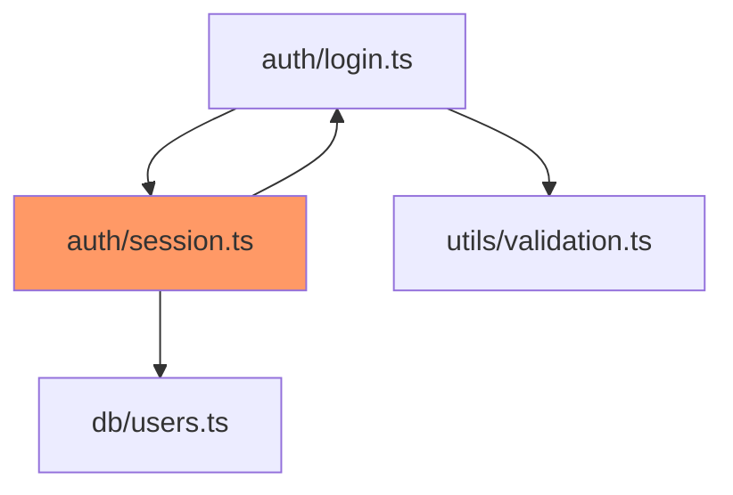
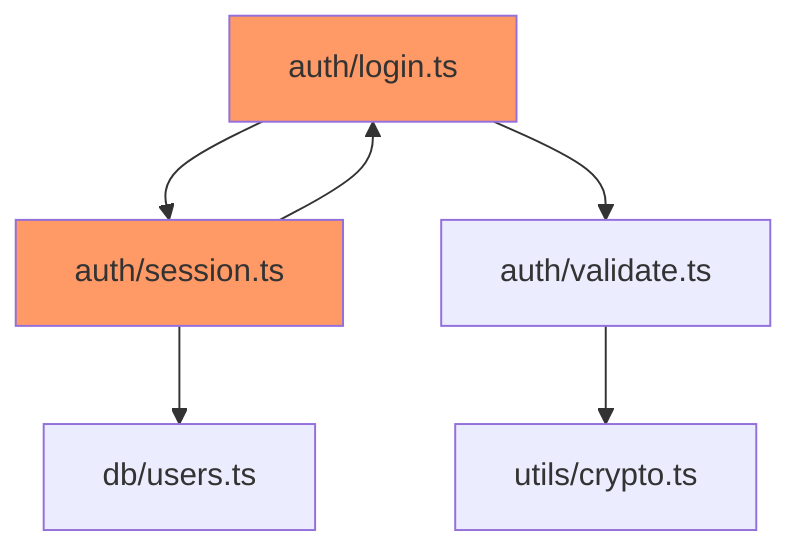

# Architecture Analyzer MCP

Detect circular dependencies, layer violations, and generate dependency graphs for your projects.

## 📦 Installation

```bash
npm install -g @j0kz/architecture-analyzer-mcp
```

Or use with npx:
```bash
npx @j0kz/architecture-analyzer-mcp
```

## 🎯 Features

✅ **Dependency Analysis**
- Detect circular dependencies
- Identify unused modules
- Map import/export relationships
- Generate dependency graphs

✅ **Architecture Validation**
- Layer violation detection
- Enforce architectural rules
- Validate module boundaries
- Check dependency direction

✅ **Metrics & Reporting**
- Module complexity scoring
- Coupling and cohesion metrics
- Modularity index calculation
- Visual dependency graphs (Mermaid)

✅ **Project Health**
- Overall architecture score
- Problematic module identification
- Refactoring recommendations
- Trend analysis over time

## 🚀 Usage

### Basic Analysis

Ask your AI editor:
```
Analyze the architecture of this project
```

### Specific Analyses

```
Find circular dependencies in src/
Generate a dependency graph for the auth module
Check for layer violations
Identify highly coupled modules
```

## 🔧 Available Tools

### 1. `analyze_architecture`

Comprehensive project architecture analysis.

**Parameters**:
- `projectPath` (string, required): Path to project root
- `config` (object, optional):
  - `detectCircular`: boolean (default: `true`)
  - `generateGraph`: boolean (default: `false`)
  - `layerRules`: object (optional) - Define layer dependencies
  - `excludePatterns`: string[] (default: `['node_modules/**', 'dist/**']`)
  - `maxDepth`: number (default: `10`)

**Example**:
```json
{
  "projectPath": "./src",
  "config": {
    "detectCircular": true,
    "generateGraph": true,
    "excludePatterns": ["node_modules/**", "*.test.ts"]
  }
}
```

**Response**:
```json
{
  "summary": {
    "totalModules": 47,
    "circularDependencies": 3,
    "layerViolations": 2,
    "overallScore": 72
  },
  "circularDependencies": [
    {
      "cycle": ["src/auth/login.ts", "src/auth/validate.ts", "src/auth/login.ts"],
      "severity": "high"
    }
  ],
  "metrics": {
    "modularity": 78,
    "coupling": 0.34,
    "cohesion": 0.72
  },
  "problematicModules": [
    {
      "path": "src/utils/helpers.ts",
      "issues": ["High coupling (25 dependencies)", "God object pattern"],
      "score": 35
    }
  ]
}
```

### 2. `get_module_info`

Get detailed information about a specific module.

**Parameters**:
- `projectPath` (string, required): Project root path
- `modulePath` (string, required): Relative path to module

**Example**:
```json
{
  "projectPath": "./",
  "modulePath": "src/api/users.ts"
}
```

**Response**:
```json
{
  "module": "src/api/users.ts",
  "imports": ["src/db/models", "src/auth/middleware", "express"],
  "exports": ["UserController", "userRouter"],
  "dependents": ["src/server.ts", "src/api/index.ts"],
  "complexity": 15,
  "linesOfCode": 234,
  "responsibilities": ["User CRUD", "Authentication", "Validation"]
}
```

### 3. `find_circular_deps`

Find all circular dependencies in the project.

**Parameters**:
- `projectPath` (string, required): Path to project

**Example**:
```json
{
  "projectPath": "./src"
}
```

**Response**:
```json
{
  "circularDependencies": [
    {
      "cycle": ["auth/login.ts", "auth/session.ts", "auth/login.ts"],
      "length": 2,
      "severity": "high"
    },
    {
      "cycle": ["utils/a.ts", "utils/b.ts", "utils/c.ts", "utils/a.ts"],
      "length": 3,
      "severity": "medium"
    }
  ],
  "totalCount": 2
}
```

## 📊 Understanding Metrics

### Modularity Score (0-100)

Measures how well-separated modules are:
- **80-100**: Excellent modularity
- **60-79**: Good modularity
- **40-59**: Needs improvement
- **0-39**: Poor modularity

### Coupling (0.0-1.0)

Measures dependency between modules:
- **0.0-0.3**: Low coupling (good)
- **0.3-0.5**: Medium coupling
- **0.5-0.7**: High coupling (bad)
- **0.7-1.0**: Very high coupling (refactor!)

### Cohesion (0.0-1.0)

Measures how focused a module is:
- **0.7-1.0**: High cohesion (good)
- **0.5-0.7**: Medium cohesion
- **0.3-0.5**: Low cohesion (bad)
- **0.0-0.3**: Very low cohesion (refactor!)

## 🎨 Dependency Graphs

### Generating Graphs

```json
{
  "projectPath": "./src",
  "config": {
    "generateGraph": true
  }
}
```

Returns Mermaid diagram:



### Graph Features

- **Red nodes**: Part of circular dependency
- **Yellow nodes**: High coupling
- **Green nodes**: Well-designed modules
- **Thick arrows**: Heavy dependencies
- **Dashed arrows**: Optional dependencies

## 🏗️ Layer Architecture

### Define Layer Rules

```json
{
  "config": {
    "layerRules": {
      "presentation": ["business"],
      "business": ["data"],
      "data": []
    }
  }
}
```

This enforces:
- Presentation layer can only depend on business layer
- Business layer can only depend on data layer
- Data layer has no dependencies

### Layer Violations

```json
{
  "layerViolations": [
    {
      "from": "presentation/UserView.ts",
      "to": "data/UserRepository.ts",
      "violation": "Presentation layer cannot directly access data layer",
      "severity": "high"
    }
  ]
}
```

## 🔍 Common Patterns Detected

### 1. Circular Dependencies

**Problem**: Module A imports B, B imports C, C imports A

**Impact**:
- Hard to test in isolation
- Difficult to understand
- Can cause initialization issues
- Makes code harder to maintain

**Solution**:
- Extract shared code to new module
- Use dependency injection
- Introduce interfaces
- Refactor to remove cycle

### 2. God Objects

**Problem**: Module imported by 20+ other modules

**Impact**:
- Central point of failure
- Hard to modify
- Testing becomes complex
- Violates Single Responsibility

**Solution**:
- Split into smaller, focused modules
- Apply Single Responsibility Principle
- Create service modules

### 3. Feature Envy

**Problem**: Module uses many methods/properties from another module

**Impact**:
- Logic in wrong place
- High coupling
- Duplication likely

**Solution**:
- Move logic to the module it uses most
- Extract to shared utility
- Introduce delegation

## 📈 Usage Examples

### Example 1: Quick Health Check

**AI Prompt**: "What's the overall architecture health?"

**Output**:
```
Architecture Health Report:

Overall Score: 72/100

✅ Strengths:
- Good modularity (78/100)
- Reasonable cohesion (0.72)
- Clean separation in business logic

⚠️  Issues:
- 3 circular dependencies detected
- 2 layer violations
- High coupling in utils module (0.45)

🔧 Recommendations:
1. Break circular dependency: auth/login ↔ auth/session
2. Fix layer violation: UserView → UserRepository
3. Split utils/helpers.ts (25 dependencies)
```

### Example 2: Module Deep Dive

**AI Prompt**: "Analyze src/api/users.ts in detail"

**Output**:
```
Module Analysis: src/api/users.ts

Dependencies (In): 8
  - src/db/models/User
  - src/auth/middleware
  - express
  - src/utils/validation
  - src/services/email
  - ...

Dependents (Out): 3
  - src/server.ts
  - src/api/index.ts
  - src/tests/api.test.ts

Metrics:
  Complexity: 15 (moderate)
  Lines of Code: 234
  Responsibilities: 3 (CRUD, Auth, Validation)

Issues:
  ⚠️  High coupling (8 dependencies)
  ⚠️  Mixed concerns (auth + CRUD)

Recommendations:
  → Extract validation to middleware
  → Separate auth concerns
  → Consider repository pattern
```

### Example 3: Dependency Graph

**AI Prompt**: "Generate dependency graph for auth module"

**Output**:


## 🛠️ Integration Patterns

### With Smart Reviewer

```
1. Analyze architecture → Find problematic modules
2. Review those modules → Get code quality issues
3. Compare metrics → Architecture + Code quality
```

### With Refactor Assistant

```
1. Find circular dependencies
2. Ask AI to refactor using dependency injection
3. Verify dependency is removed
```

### With Test Generator

```
1. Find modules with high complexity
2. Generate tests for those modules
3. Verify testability improves
```

## 📚 Best Practices

1. **Run regularly**: Check architecture weekly
2. **Set thresholds**: Define acceptable modularity/coupling
3. **Track trends**: Monitor metrics over time
4. **Fix violations**: Address layer violations immediately
5. **Document rules**: Define and enforce layer architecture
6. **Review graphs**: Visualize dependencies periodically

## 🔧 Configuration Examples

### Strict Mode

```json
{
  "config": {
    "detectCircular": true,
    "layerRules": {
      "controllers": ["services"],
      "services": ["repositories"],
      "repositories": ["models"],
      "models": []
    },
    "maxComplexity": 10,
    "maxCoupling": 0.3
  }
}
```

### Legacy Project Mode

```json
{
  "config": {
    "detectCircular": true,
    "generateGraph": false,
    "excludePatterns": [
      "node_modules/**",
      "legacy/**",
      "vendor/**"
    ],
    "maxDepth": 5
  }
}
```

## 🆘 Troubleshooting

### Too Many Circular Dependencies

**Problem**: 50+ circular dependencies found

**Solution**:
- Start with shortest cycles (length 2)
- Focus on one layer at a time
- Use dependency injection
- Extract interfaces

### Graph Too Large

**Problem**: Mermaid graph unreadable

**Solution**:
- Analyze specific subdirectories
- Use `maxDepth` to limit
- Generate multiple smaller graphs
- Focus on problematic modules only

### False Positives

**Problem**: Reporting valid dependencies as violations

**Solution**:
- Adjust `layerRules`
- Add to `excludePatterns`
- Check module boundaries definition
- Verify layer assignment

## 📖 See Also

- [Smart Reviewer](Smart-Reviewer) - Code quality analysis
- [Refactor Assistant](Refactor-Assistant) - Fix architecture issues
- [Integration Patterns](Integration-Patterns) - Chain with other tools
- [Best Practices](Best-Practices) - Architecture guidelines

---

**[← Back to Home](Home)** | **[Next: Test Generator →](Test-Generator)**
